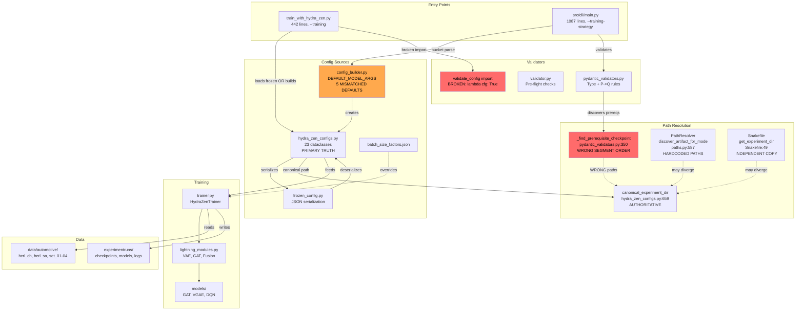
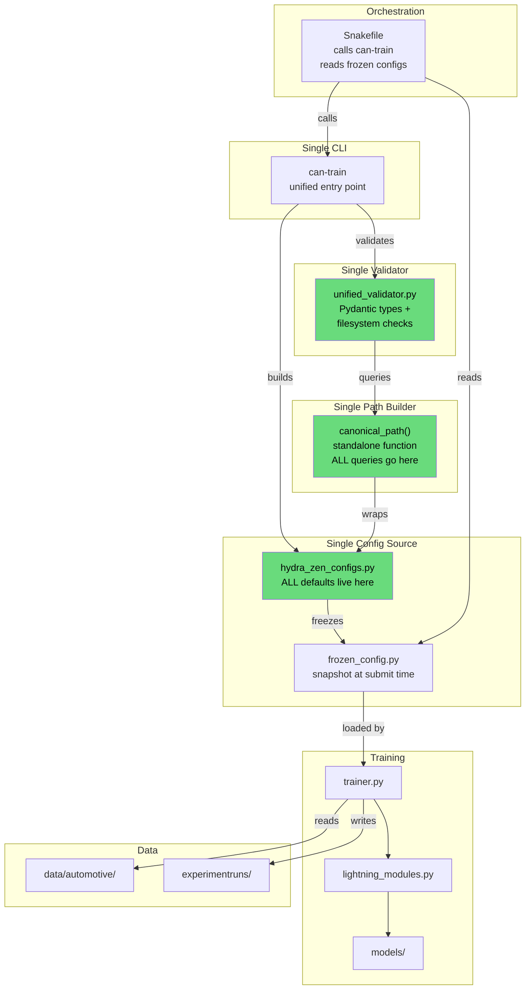

# KD-GAT Codebase Synthesis: Diagnosis and Fix Plan

**Replaces**: EVALUATION_FIX_SUMMARY.md, VISUALIZATION_INFRASTRUCTURE_SUMMARY.md, MARIMO_SETUP.md,
SNAKEMAKE_MIGRATION_PLAN.md, SNAKEMAKE_MIGRATION_TODO.md, SNAKEMAKE_SUMMARY.md, SNAKEMAKE_QUICKSTART.md,
README_SNAKEMAKE.md, docs/analysis/configuration_system_analysis.md, docs/analysis/PARAMETER_AUDIT.md,
docs/analysis/PIPELINE_INVESTIGATION.md, docs/analysis/FROZEN_CONFIG_ROADMAP.md

---

## 1. Three Root Problems

Every configuration bug, path mismatch, and "fix that breaks something else" traces back to one of these three root causes.

### A. No Single Source of Truth (CRITICAL)

Five independent locations define configuration defaults. When you change one, the others silently disagree.

| Source | File | Role | Example Conflict |
|--------|------|------|-----------------|
| Dataclass defaults | `src/config/hydra_zen_configs.py` | Primary config system | `lr=0.005` (line 24) |
| CLI fallback dict | `src/cli/config_builder.py:21-43` | `DEFAULT_MODEL_ARGS` | `learning_rate=0.003` (line 23) |
| Batch factors JSON | `config/batch_size_factors.json` | Per-dataset safety | Overrides BatchSizeConfig |
| Pydantic validators | `src/cli/pydantic_validators.py` | Type + P->Q rules | Hardcoded valid combos |
| Pre-flight validator | `src/cli/validator.py` | Filesystem checks | Separate from Pydantic |

**5 confirmed parameter mismatches** between `DEFAULT_MODEL_ARGS` and the dataclass defaults:

| Parameter | config_builder.py | hydra_zen_configs.py | Difference |
|-----------|-------------------|---------------------|------------|
| learning_rate | 0.003 (line 23) | 0.005 (OptimizerConfig:24) | 40% |
| epochs vs max_epochs | 50 (line 22) | 400 (BaseTrainingConfig:316) | 8x + naming mismatch |
| replay_buffer_size | 10,000 (line 42) | 100,000 (DQNConfig:212) | 10x |
| weight_decay | 0.0 (line 27) | 0.0001 (BaseTrainingConfig:319) | zero vs non-zero |
| patience | 10 (line 29) | 100 (BaseTrainingConfig:326) | 10x |

**Broken validator**: `train_with_hydra_zen.py:51` imports `validate_config` via `getattr` with fallback `lambda cfg: True`. The function doesn't exist in `hydra_zen_configs.py`, so runtime validation is a **permanent no-op**.

### B. Path Hierarchy Disagreement (CRITICAL)

Four independent implementations construct experiment directory paths. Two have confirmed bugs.

**Canonical order** (`hydra_zen_configs.py:659`):
```
{modality}/{dataset}/{learning_type}/{model}/{model_size}/{distillation}/{mode}
```

**`_find_prerequisite_checkpoint`** (`pydantic_validators.py:350-358`) -- **BUGGY**:
```
{modality}/{dataset}/{model_size}/{learning_type}/{model}/{no-kd}/{mode}
                      ^^^^^^^^^^   ^^^^^^^^^^^^^         ^^^^^^
                      SWAPPED with learning_type         WRONG STRING
```

This function constructs paths that **will never match** the canonical directory layout. It also uses `"no-kd"` (line 357) instead of `"no_distillation"`. Ironically, `canonical_save_path` in the **same file** (line 383) uses the correct order.

**PathResolver.discover_artifact_for_mode** (`src/paths.py:587`) hardcodes its own path segments independently of `canonical_experiment_dir()`.

**Snakefile** (`Snakefile:49-65`) reimplements path logic a 4th time with hardcoded `learning_type_map` and `mode_map` dicts. Currently matches canonical order but has no enforced sync.

### C. Duplicated Subsystems (MODERATE)

| Subsystem | Copies | Files |
|-----------|--------|-------|
| CLI entry points | 2 | `train_with_hydra_zen.py` (--training), `src/cli/main.py` (--training-strategy) |
| Validation | 3 | Pydantic (CLI), pre-flight (filesystem), runtime (broken no-op) |
| Batch size tuning | 4 | `adaptive_batch_size.py`, `batch_optimizer.py`, `BatchSizeConfig`, `trainer.py` |
| Memory management | 4 | `MemoryOptimizationConfig`, `memory_monitor_callback.py`, `knowledge_distillation.py`, `lightning_modules.py` |
| Curriculum learning | 3 | `modes/curriculum.py`, `momentum_curriculum.py`, `memory_preserving_curriculum.py` |
| Debug print() calls | 22 | `src/models/vgae.py:61-149` (should be logger) |

---

## 2. Current State: Interaction Map



**Red = broken**, **Orange = conflicting defaults**. Dashed lines = potential divergence.

---

## 3. Target State: Consolidated Pipeline



Key changes: one config source, one validator, one path function, Snakefile delegates to Python.

---

## 4. Solution Architecture

### Pillar 1: Eliminate DEFAULT_MODEL_ARGS
Delete the `DEFAULT_MODEL_ARGS` dict (`config_builder.py:21-43`). The 23 dataclass definitions in `hydra_zen_configs.py` already contain correct, typed defaults. `merge_with_defaults()` should read defaults from `dataclasses.fields()` metadata instead of a separate dict. This single change fixes all 5 parameter mismatches.

### Pillar 2: Unify Path Construction
Extract a standalone `canonical_path(modality, dataset, learning_type, model, model_size, distillation, mode)` function from the existing `canonical_experiment_dir()` method. Then:
- `_find_prerequisite_checkpoint` calls it (fixing the segment order bug)
- `PathResolver.discover_artifact_for_mode()` calls it (eliminating hardcoded paths)
- `Snakefile` imports it via a helper script (eliminating the independent copy)

### Pillar 3: Single CLI + Single Validator
- `can-train` (via `src/cli/main.py`) remains the user-facing CLI
- `train_with_hydra_zen.py` is stripped to **frozen-config loader only** (~50 lines) -- SLURM/Snakemake jobs call it with `--frozen-config`
- Merge Pydantic type validation and pre-flight filesystem checks into one `validate_config()` in `validator.py`
- Fix the broken import in `train_with_hydra_zen.py:51` to call the real validator

### Pillar 4: Dead Code Cleanup
- Replace 22 `print()` calls in `vgae.py:61-149` with `logger.debug()`
- Merge `momentum_curriculum.py` (135 lines) and `memory_preserving_curriculum.py` (157 lines) into `modes/curriculum.py`
- Remove `batch_optimizer.py` (298 lines) -- keep `adaptive_batch_size.py` as the single batch tuner
- Consolidate memory cleanup into `memory_monitor_callback.py`
- Remove deprecated `--preset` support

---

## 5. Actionable Steps

### Phase 1: Fix Critical Bugs
*No architectural changes. Fixes silent failures.*

| # | Action | File | Lines |
|---|--------|------|-------|
| 1 | Fix broken validator import: change `getattr(_cfg_mod, 'validate_config', lambda cfg: True)` to import from `src.cli.validator` | `train_with_hydra_zen.py` | 51 |
| 2 | Fix path segment order in `_find_prerequisite_checkpoint`: change to `[experiment_root, modality, dataset, learning_type or "*", model or "*", model_size, "no_distillation", mode or "*"]` | `src/cli/pydantic_validators.py` | 350-358 |
| 3 | Fix distillation string: `"no-kd"` -> `"no_distillation"` | `src/cli/pydantic_validators.py` | 357 |
| 4 | Decide learning_rate default (recommend 0.003) -- update `OptimizerConfig.lr` | `src/config/hydra_zen_configs.py` | 24 |
| 5 | Run existing tests | - | - |

### Phase 2: Single Source of Truth
*Eliminates conflicting defaults.*

| # | Action | File | Lines |
|---|--------|------|-------|
| 6 | Delete `DEFAULT_MODEL_ARGS` dict | `src/cli/config_builder.py` | 21-43 |
| 7 | Update `merge_with_defaults()` to read from dataclass `fields()` | `src/cli/config_builder.py` | (find call sites) |
| 8 | Rename `epochs` -> `max_epochs` in CLI arg handling | `src/cli/main.py`, `config_builder.py` | - |
| 9 | Verify frozen config round-trip: create, serialize, deserialize, assert equal | test file | - |
| 10 | Run full test suite | - | - |

### Phase 3: Unify Paths and Validators
*Single path builder, single validator.*

| # | Action | File | Lines |
|---|--------|------|-------|
| 11 | Extract `canonical_path()` as standalone function | `src/config/hydra_zen_configs.py` | 655-690 |
| 12 | Make `_find_prerequisite_checkpoint` call `canonical_path()` | `src/cli/pydantic_validators.py` | 349-375 |
| 13 | Make `discover_artifact_for_mode()` call `canonical_path()` | `src/paths.py` | 587+ |
| 14 | Make Snakefile import `canonical_path()` from Python | `Snakefile` | 49-65 |
| 15 | Merge Pydantic + pre-flight into single `validate_config()` | `src/cli/validator.py` | - |
| 16 | Run integration tests for all 4 training modes | - | - |

### Phase 4: Dead Code Cleanup
*Non-breaking. Can be incremental.*

| # | Action | File | Lines |
|---|--------|------|-------|
| 17 | Replace 22 `print()` with `logger.debug()` | `src/models/vgae.py` | 61-149 |
| 18 | Merge curriculum files into `modes/curriculum.py` | `momentum_curriculum.py`, `memory_preserving_curriculum.py` | all |
| 19 | Remove `batch_optimizer.py`, keep `adaptive_batch_size.py` | `src/training/batch_optimizer.py` | all |
| 20 | Consolidate memory cleanup into `memory_monitor_callback.py` | multiple | - |
| 21 | Remove `--preset` support | `train_with_hydra_zen.py` | 68+ |
| 22 | Delete superseded analysis markdown files | project root | see Appendix C |

---

## Appendix A: Parameter Mismatch Detail

| Parameter | `DEFAULT_MODEL_ARGS` (config_builder.py) | Dataclass (hydra_zen_configs.py) | Who Wins at Runtime? |
|-----------|------------------------------------------|----------------------------------|---------------------|
| learning_rate | 0.003 (line 23) | OptimizerConfig.lr = 0.005 (line 24) | Depends on entry point |
| epochs / max_epochs | epochs = 50 (line 22) | BaseTrainingConfig.max_epochs = 400 (line 316) | CLI → 50, direct → 400 |
| replay_buffer_size | 10,000 (line 42) | DQNConfig.buffer_size = 100,000 (line 212) | CLI → 10k, direct → 100k |
| weight_decay | 0.0 (line 27) | BaseTrainingConfig.weight_decay = 0.0001 (line 319) | CLI → 0, direct → 0.0001 |
| patience | 10 (line 29) | BaseTrainingConfig.early_stopping_patience = 100 (line 326) | CLI → 10, direct → 100 |

## Appendix B: Path Hierarchy Comparison

| Implementation | Location | Segment Order | Distillation String |
|----------------|----------|---------------|-------------------|
| `canonical_experiment_dir()` | hydra_zen_configs.py:659 | modality/dataset/**learning_type/model/model_size**/distillation/mode | `no_distillation` |
| `_find_prerequisite_checkpoint()` | pydantic_validators.py:350 | modality/dataset/**model_size/learning_type/model**/distillation/mode | `no-kd` **BUG** |
| `discover_artifact_for_mode()` | paths.py:587 | Hardcoded per-mode canonical paths | `no_distillation` |
| `get_experiment_dir()` | Snakefile:49 | modality/dataset/learning_type/model/model_size/distillation/mode | `no_distillation` |

## Appendix C: Files Superseded by This Document

These files can be deleted after this synthesis is adopted:

- `EVALUATION_FIX_SUMMARY.md` -- evaluation fix is now in production, diagnosis captured here
- `VISUALIZATION_INFRASTRUCTURE_SUMMARY.md` -- visualization infra is stable, pattern documented here
- `MARIMO_SETUP.md` -- operational guide, keep only if Marimo is actively used
- `SNAKEMAKE_MIGRATION_PLAN.md` -- migration steps consolidated into Phase 3 here
- `SNAKEMAKE_MIGRATION_TODO.md` -- 250+ checklist items, superseded by 22 focused steps here
- `SNAKEMAKE_SUMMARY.md` -- summary of Snakemake benefits, captured in Section 4
- `SNAKEMAKE_QUICKSTART.md` -- command reference, keep as separate operational doc
- `README_SNAKEMAKE.md` -- duplicates quickstart content
- `docs/analysis/configuration_system_analysis.md` -- all 10 conflicts captured in Sections 1-2
- `docs/analysis/PARAMETER_AUDIT.md` -- all mismatches in Appendix A
- `docs/analysis/PIPELINE_INVESTIGATION.md` -- pipeline flow captured in Section 2
- `docs/analysis/FROZEN_CONFIG_ROADMAP.md` -- roadmap items in Phase 2-3 steps
