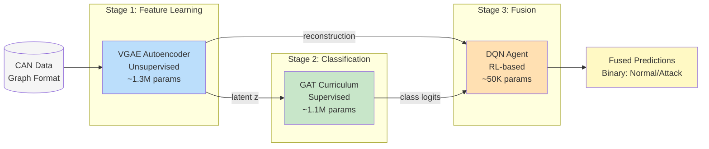
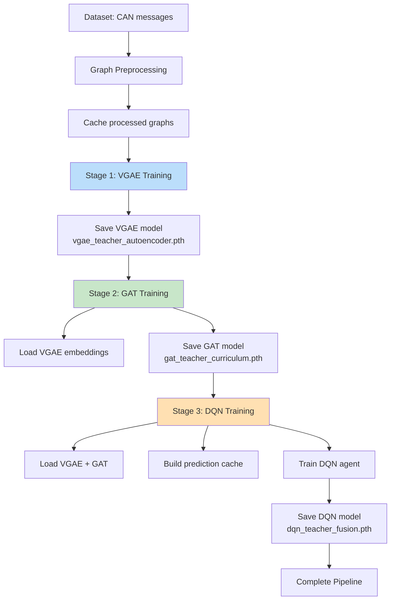
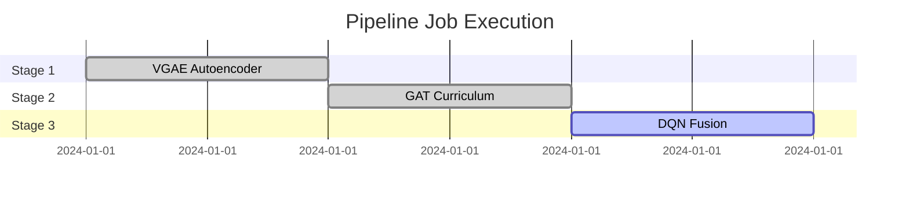
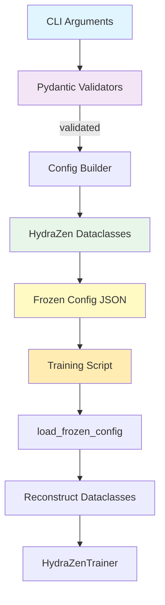

# KD-GAT Architecture Documentation

**CAN Network Intrusion Detection with Graph Neural Networks and Knowledge Distillation**

This document provides a comprehensive overview of the KD-GAT system architecture, training pipeline, and implementation patterns.

---

## System Overview

KD-GAT implements a three-stage graph neural network pipeline for CAN bus intrusion detection:

1. **Stage 1: Unsupervised Feature Learning (VGAE)** - Learns latent representations from CAN message graphs
2. **Stage 2: Supervised Classification (GAT)** - Classifies messages as normal/attack using curriculum learning
3. **Stage 3: Reinforcement Learning Fusion (DQN)** - Fuses VGAE and GAT predictions using a DQN agent



---

## Training Pipeline

### Sequential Training Flow



### SLURM Job Dependencies

When submitted via `./can-train pipeline --submit`, jobs are chained with SLURM dependencies:



- **Job 1 (VGAE)**: Runs immediately on submission
- **Job 2 (GAT)**: `--dependency=afterok:<job1_id>` - starts when VGAE completes successfully
- **Job 3 (DQN)**: `--dependency=afterok:<job2_id>` - starts when GAT completes successfully

---

## CLI Parameter Flow

See [Parameter Flow Diagram](diagrams/parameter_flow.md) for detailed flow from CLI → SLURM → Training.

**Key concept: Frozen Config Pattern**

All pipeline jobs use frozen configs to ensure reproducibility:

```
./can-train pipeline --model vgae,gat,dqn --dataset hcrl_sa --submit
    ↓
Freeze config to JSON (timestamp: 20260126_220158)
    ↓
Generate SLURM script with --frozen-config path
    ↓
SLURM executes: python train_with_hydra_zen.py --frozen-config frozen_config_20260126_220158.json
```

---

## Directory Structure

Experiments use a canonical hierarchical structure:

```
experimentruns/{modality}/{dataset}/{learning_type}/{model}/{model_size}/{distillation}/{mode}/
```

**Example**:
```
experimentruns/automotive/hcrl_sa/supervised/gat/teacher/no_distillation/curriculum/
├── configs/
│   └── frozen_config_20260126_220158.json    # Frozen configuration
├── slurm_logs/
│   ├── gat_hcrl_sa_curriculum_20260126_220158.out
│   ├── gat_hcrl_sa_curriculum_20260126_220158.err
│   └── gat_hcrl_sa_curriculum.sh             # SLURM script
├── checkpoints/                               # Training checkpoints
├── models/                                    # Final trained models
│   └── gat_teacher_curriculum.pth
└── mlruns/                                    # MLflow tracking
```

See [Directory Structure Diagram](diagrams/directory_structure.md) for visual representation.

---

## Knowledge Distillation Architecture

KD-GAT supports teacher-student knowledge distillation for model compression:

```mermaid
flowchart TB
    subgraph Teacher["Teacher Models (Frozen)"]
        T_VGAE[VGAE Teacher<br/>1.3M params<br/>Frozen]
        T_GAT[GAT Teacher<br/>1.1M params<br/>Frozen]
    end

    subgraph Student["Student Models (Training)"]
        S_VGAE[VGAE Student<br/>~300K params]
        S_GAT[GAT Student<br/>~250K params]
    end

    subgraph Loss
        KD_Loss[KD Loss<br/>α × KL(soft_teacher || soft_student)]
        Task_Loss[Task Loss<br/>(1-α) × CE(labels, predictions)]
        Total[Total Loss = KD + Task]
    end

    T_VGAE -->|soft latent z<br/>temperature T| KD_Loss
    T_GAT -->|soft logits<br/>temperature T| KD_Loss
    S_VGAE --> KD_Loss
    S_GAT --> KD_Loss

    S_VGAE --> Task_Loss
    S_GAT --> Task_Loss

    KD_Loss --> Total
    Task_Loss --> Total

    Total -->|backprop<br/>update weights| S_VGAE
    Total -->|backprop<br/>update weights| S_GAT

    style T_VGAE fill:#e3f2fd
    style T_GAT fill:#e8f5e9
    style S_VGAE fill:#bbdefb
    style S_GAT fill:#c8e6c9
    style Total fill:#ffccbc
```

**Parameters**:
- `α` (alpha): Balance between KD loss and task loss (default: 0.7)
- `T` (temperature): Softens probability distributions (default: 4.0)

**Usage**:
```bash
./can-train pipeline \
  --model vgae,gat \
  --training-strategy autoencoder,curriculum \
  --model-size student \
  --distillation with-kd \
  --teacher_path experimentruns/.../vgae_teacher.pth
```

---

## Model Architectures

### VGAE (Variational Graph Autoencoder)

**Purpose**: Unsupervised learning of latent CAN message representations

**Architecture**:
- **Encoder**: GAT layers → μ and log(σ²)
- **Latent Space**: Reparameterization z = μ + σ * ε
- **Decoder**: Inner product decoder for edge reconstruction

**Loss**: ELBO = Reconstruction Loss + KL Divergence

**Config**: [VGAEConfig](../src/config/hydra_zen_configs.py#L92)

### GAT (Graph Attention Network)

**Purpose**: Supervised binary classification (normal vs attack)

**Architecture**:
- Multi-head attention layers
- Residual connections
- Fully connected classifier head

**Training**: Curriculum learning (easy → hard samples)

**Config**: [GATConfig](../src/config/hydra_zen_configs.py#L51)

### DQN (Deep Q-Network)

**Purpose**: Fusion agent that learns optimal combination of VGAE + GAT predictions

**State Space**:
- VGAE reconstruction probability
- GAT classification logits
- Graph features

**Action Space**: Binary (accept VGAE, accept GAT)

**Reward**: +1 for correct prediction, -1 for incorrect

**Config**: [DQNConfig](../src/config/hydra_zen_configs.py#L149)

---

## Configuration System

KD-GAT uses a hierarchical configuration system:



**Validation Layers**:
1. **Pydantic** ([pydantic_validators.py](../src/cli/pydantic_validators.py)): CLI input validation, P→Q rules
2. **Config Builder** ([config_builder.py](../src/cli/config_builder.py)): Bucket parsing, config construction
3. **Validator** ([validator.py](../src/cli/validator.py)): Pre-flight validation (artifacts, SLURM resources)
4. **HydraZen** ([hydra_zen_configs.py](../src/config/hydra_zen_configs.py)): Config schema definitions

---

## Key Implementation Files

| Component | File | Description |
|-----------|------|-------------|
| **CLI** | [src/cli/main.py](../src/cli/main.py) | CLI entry point, argument parsing |
| **Job Manager** | [src/cli/job_manager.py](../src/cli/job_manager.py) | SLURM job submission, dependency handling |
| **Config System** | [src/config/hydra_zen_configs.py](../src/config/hydra_zen_configs.py) | All config dataclasses |
| **Frozen Configs** | [src/config/frozen_config.py](../src/config/frozen_config.py) | Serialization/deserialization |
| **Training** | [src/training/trainer.py](../src/training/trainer.py) | Main training orchestration |
| **VGAE** | [src/models/vgae.py](../src/models/vgae.py) | VGAE model implementation |
| **GAT** | [src/models/models.py](../src/models/models.py) | GAT model implementation |
| **DQN** | [src/models/dqn.py](../src/models/dqn.py) | DQN agent implementation |
| **Fusion Mode** | [src/training/modes/fusion.py](../src/training/modes/fusion.py) | DQN fusion training logic |
| **Curriculum Mode** | [src/training/modes/curriculum.py](../src/training/modes/curriculum.py) | GAT curriculum training logic |

---

## Further Reading

- [Parameter Flow Diagram](diagrams/parameter_flow.md) - Detailed CLI → SLURM → Training flow
- [Directory Structure](diagrams/directory_structure.md) - Canonical experiment paths
- [Frozen Config Pattern](.claude/system/PROJECT_OVERVIEW.md) - Reproducible config management
- [Batch Size Optimization](ADAPTIVE_BATCH_SIZE_SYSTEM.md) - Memory-aware batch sizing

---

## Quick Start

**Run full 3-stage pipeline**:
```bash
./can-train pipeline \
  --modality automotive \
  --model vgae,gat,dqn \
  --learning-type unsupervised,supervised,rl_fusion \
  --training-strategy autoencoder,curriculum,fusion \
  --dataset hcrl_sa \
  --model-size teacher \
  --distillation no-kd \
  --submit
```

**Train single model**:
```bash
./can-train train \
  --modality automotive \
  --model gat \
  --learning-type supervised \
  --training-strategy curriculum \
  --dataset hcrl_sa \
  --model-size teacher \
  --distillation no-kd
```

**Dry-run (preview without execution)**:
```bash
./can-train pipeline ... --dry-run
```
