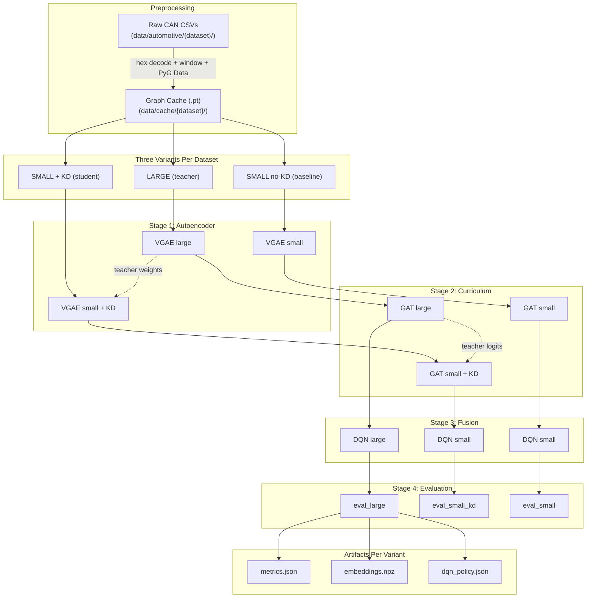
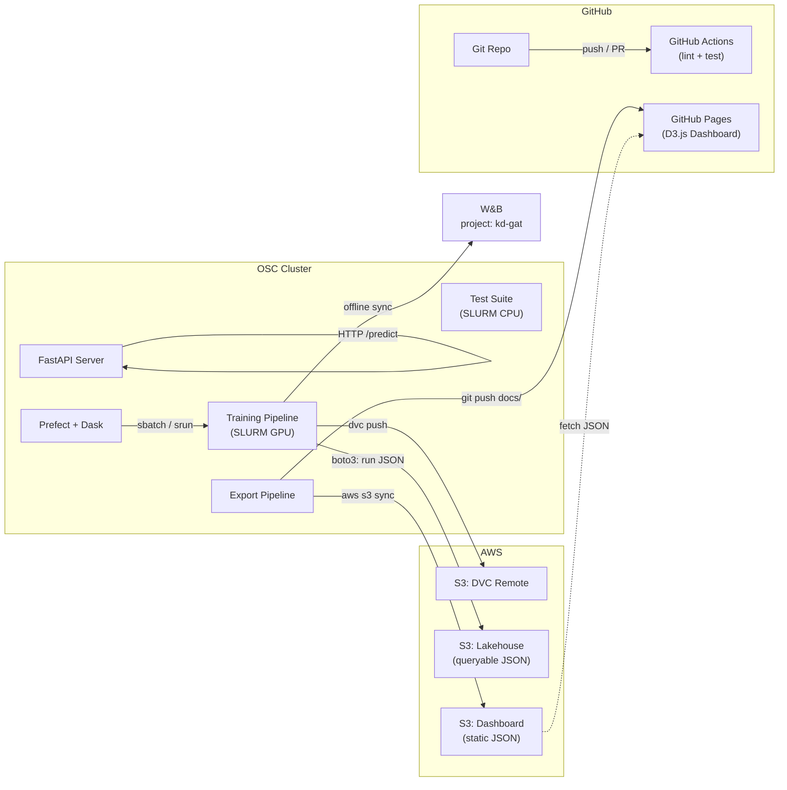
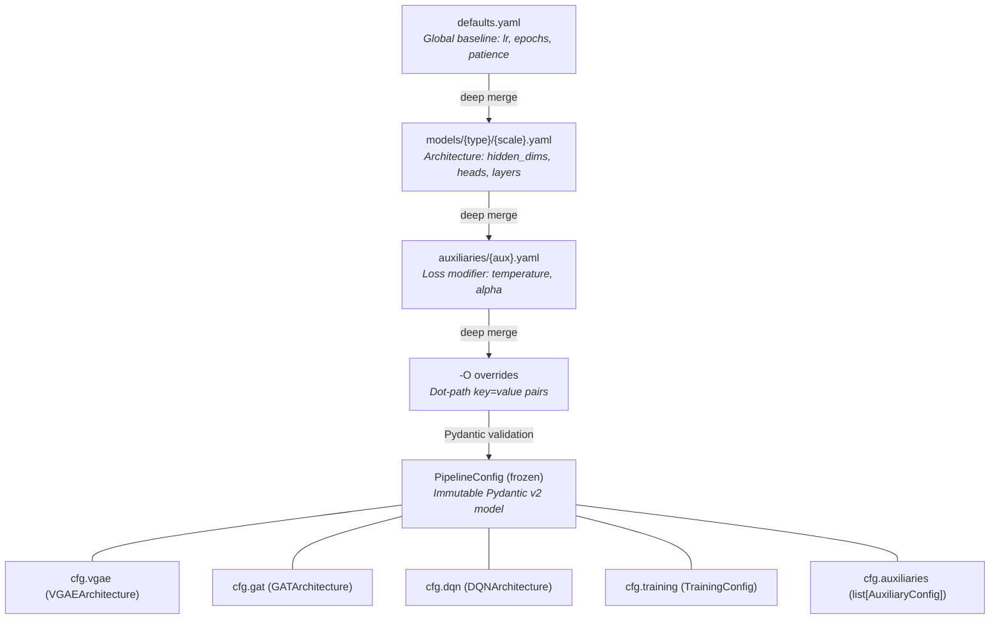

# KD-GAT Ecosystem Overview

A comprehensive mental model of the entire KD-GAT system: where data lives, how it flows through training, where metrics go, and how all external services connect.

**Audience**: New contributors, reviewers, and future-you after a break.

---

## Diagram 1: The Big Picture (30,000-foot view)

Everything lives inside four zones: the OSC cluster (all compute), AWS (storage + hosting), GitHub (code + CI + Pages), and W&B (experiment tracking). Arrows show data flow direction.

```
┌─────────────────────────────────────────────────────────────────────────────┐
│  OSC Cluster (Ohio Supercomputer Center)                                   │
│                                                                            │
│  ┌──────────────┐    ┌──────────────────┐    ┌────────────────────────┐    │
│  │ Raw CAN Data │───►│ Training Pipeline │───►│ experimentruns/        │    │
│  │ (DVC-tracked)│    │ (SLURM GPU jobs)  │    │ models + metrics +     │    │
│  └──────────────┘    └──────────────────┘    │ embeddings + policy    │    │
│         │                                     └────────┬───────────────┘    │
│         │                                              │                    │
│         │                    ┌──────────────────────────┤                    │
│         │                    │                          │                    │
│         │              ┌─────▼──────┐          ┌────────▼─────────┐         │
│         │              │ Lakehouse  │          │ Export Pipeline   │         │
│         │              │ sync       │          │ (filesystem→JSON) │         │
│         │              └─────┬──────┘          └────────┬─────────┘         │
│         │                    │                          │                    │
└─────────┼────────────────────┼──────────────────────────┼────────────────────┘
          │                    │                          │
          ▼                    ▼                          ▼
    ┌───────────┐     ┌──────────────┐          ┌──────────────────┐
    │ S3: DVC   │     │ S3: Lakehouse│          │ S3: Dashboard    │
    │ remote    │     │ (queryable)  │          │ static JSON      │
    └───────────┘     └──────────────┘          └────────┬─────────┘
                                                         │
                                                         ▼
                                                ┌──────────────────┐
                                                │ GitHub Pages     │
                                                │ D3.js Dashboard  │
                                                └──────────────────┘

    ┌──────────────────┐                        ┌──────────────────┐
    │ GitHub Actions   │ ◄──push/PR──────────── │ GitHub Repo      │
    │ CI (lint+test)   │                        │ (code + docs/)   │
    └──────────────────┘                        └──────────────────┘

    ┌──────────────────┐
    │ W&B (wandb.ai)   │ ◄──online/offline sync── training stages
    │ project: kd-gat  │
    └──────────────────┘
```

**Key takeaway**: The OSC cluster is the single source of truth. Everything else (S3, GitHub Pages, W&B) is a downstream consumer of artifacts produced on the cluster.

---

## Diagram 2: Training Pipeline — The 4-Stage Chain

The core ML pipeline. Each stage reads the previous stage's checkpoint and produces its own. Three variants run per dataset: **large** (teacher), **small+KD** (student), and **small no-KD** (baseline).



### What Each Stage Reads and Writes

| Stage | Reads | Writes | Key File |
|-------|-------|--------|----------|
| **1. VGAE (autoencoder)** | Graph cache | Reconstruction weights | `best_model.pt` |
| **2. GAT (curriculum)** | VGAE checkpoint (difficulty scoring) | Classifier weights | `best_model.pt` |
| **3. DQN (fusion)** | VGAE + GAT checkpoints (frozen) | Q-network weights | `best_model.pt` |
| **4. Evaluation** | All 3 checkpoints + test graphs | Metrics + artifacts | `metrics.json`, `embeddings.npz`, `dqn_policy.json` |

**Source files**: [`pipeline/stages/`](../pipeline/stages/), [`pipeline/cli.py`](../pipeline/cli.py)

---

## Diagram 3: Data Lifecycle — From CSV to Dashboard

Every transformation the data goes through, with file formats and storage locations.

```
data/automotive/{dataset}/
  train_01_attack_free/*.csv        <- Raw CAN bus: timestamp, arb_id, data_field, attack
  train_02_with_attacks/*.csv       <- DVC-tracked (pointer files in git, blobs on scratch/S3)
  test_01_*/ ... test_06_*/
        |
        |  src/preprocessing/preprocessing.py
        |  - hex decode + 8-byte padding + normalize [0,1]
        |  - sliding windows (size=100, stride=100)
        |  - PyG Data(x=[N,11], edge_index=[2,E], edge_attr=[E,11], y=0|1)
        v
data/cache/{dataset}/
  processed_graphs.pt               <- PyTorch: list[Data]  (train+val)
  id_mapping.pkl                    <- {hex_CAN_ID -> int index, 'OOV' -> N}
  cache_metadata.json               <- graph_stats, preprocessing_version, dimensions
  test_01_*.pt ... test_0N_*.pt     <- per-scenario test graphs (built separately)
        |
        |  pipeline/stages/ (Lightning training on SLURM GPU nodes)
        v
experimentruns/{dataset}/{model}_{scale}_{stage}[_kd]/
  config.json                       <- frozen PipelineConfig (all hyperparams)
  best_model.pt                     <- model state dict (inference)
  csv_logs/*/metrics.csv            <- per-epoch loss/accuracy curves
        |
        |  pipeline/stages/evaluation.py
        v
experimentruns/{dataset}/eval_{scale}_evaluation[_kd]/
  metrics.json                      <- {gat: {core, additional}, vgae: ..., fusion: ..., test: {...}}
  embeddings.npz                    <- vgae_z, gat_emb, labels, errors
  attention_weights.npz             <- per-layer GAT attention alphas
  dqn_policy.json                   <- alpha distribution by class
        |
        +---> pipeline/lakehouse.py ---> s3://kd-gat/lakehouse/runs/{run_id}.json
        |     (fire-and-forget, flat JSON: run_id + flattened core metrics)
        |     Queryable: SELECT * FROM read_json('s3://kd-gat/lakehouse/runs/*.json')
        |
        +---> pipeline/export.py ---> docs/dashboard/data/
        |     Light (~2s):  leaderboard.json, runs.json, datasets.json, kd_transfer.json,
        |                   training_curves/, metrics/, model_sizes.json
        |     Heavy (SLURM): embeddings/ (UMAP 2D), graph_samples.json, dqn_policy/,
        |                    roc_curves/, attention/, recon_errors/
        |
        +---> scripts/export_dashboard.sh
              1. python -m pipeline.export
              2. aws s3 sync docs/dashboard/data/ s3://kd-gat/dashboard/
              3. git add + commit + push  (GitHub Pages deploys from docs/)
              4. dvc push -r s3
```

**Key insight**: The data flows in one direction from raw CSVs to dashboard. There are no feedback loops. Each transformation is idempotent — you can re-run any step from its inputs.

---

## Diagram 4: External Services & Connection Points



### Connection Reference Table

| Service | Protocol | Direction | What Flows | When |
|---------|----------|-----------|------------|------|
| **SLURM** (OSC) | `sbatch` / `srun` | Local | Job submission (GPU training, CPU testing/export) | Every training/eval/test run |
| **W&B** (wandb.ai) | Python SDK | Outbound | Per-epoch metrics, config, tags | During training (offline on compute, sync later) |
| **S3** (`kd-gat` bucket) | boto3 / AWS CLI | Bidirectional | Lakehouse JSON, dashboard data, DVC blobs | After each stage (lakehouse), after export (dashboard) |
| **DVC** (scratch GPFS) | `dvc push/pull` | Bidirectional | Raw data + cache blobs | Data versioning |
| **GitHub Actions** | Webhook | Triggered by push/PR | Ruff lint, JS syntax check, pytest (3 test files) | On push to main (filtered by path) |
| **GitHub Pages** | `git push` to `docs/` | Outbound | Static HTML/JS/JSON dashboard | After export script |
| **Prefect** | Python SDK | Local orchestration | Flow DAG, task retry, subprocess dispatch | `pipeline.cli flow` |
| **Dask-jobqueue** | SLURM cluster | Local | Worker provisioning for Prefect tasks | When `--local` is NOT used |
| **FastAPI** | HTTP REST | Inbound | `/predict` (graph->label), `/health` | When serving (`uvicorn`) |
| **D3.js CDN** | `<script>` in browser | Inbound (browser) | Visualization library | Dashboard page load |

---

## Diagram 5: OSC Cluster — Filesystem Layout

```
/users/PAS2022/rf15/                           <- NFS home (permanent)
  CAN-Graph-Test/KD-GAT/                       <- Git repo root
    config/                                    <- Layer 1: declarative config
    pipeline/                                  <- Layer 2: orchestration
    src/                                       <- Layer 3: domain (models, training)
    data/
      automotive/                              <- Raw datasets (DVC-tracked)
        hcrl_ch/, hcrl_sa/, set_01-04/
      cache/                                   <- Preprocessed graphs (DVC-tracked)
        {dataset}/processed_graphs.pt
    experimentruns/                            <- All training outputs
      {dataset}/
        vgae_large_autoencoder/
        gat_large_curriculum/
        dqn_large_fusion/
        eval_large_evaluation/
        vgae_small_autoencoder_kd/
        gat_small_curriculum_kd/
        ... (3 variants x 4 stages = 12 dirs per dataset)
    docs/dashboard/                            <- GitHub Pages site
      data/                                    <- Static JSON (exported)
      js/                                      <- D3.js ES modules
    scripts/                                   <- SLURM job scripts
    wandb/                                     <- Offline W&B runs (.gitignored)
    .dvc/                                      <- DVC config

/fs/scratch/PAS1266/                           <- GPFS scratch (90-day purge)
  can-graph-dvc/                               <- DVC primary remote (fast local)
  .prefect/                                    <- Prefect state (avoids NFS issues)
  .dask-logs/                                  <- Dask worker logs
```

**Why two filesystems?** NFS home is permanent but slow for parallel I/O. GPFS scratch is fast but purged after 90 days. Large blobs (DVC data, Prefect state, Dask logs) live on scratch; everything else on NFS.

---

## Diagram 6: Config Resolution — How a Run Gets Configured



### Resolution in Practice

```python
from config import resolve, PipelineConfig

# No KD — large teacher
cfg = resolve("vgae", "large", dataset="hcrl_sa")

# With KD — small student
cfg = resolve("gat", "small", auxiliaries="kd_standard", dataset="hcrl_sa")

cfg.vgae.latent_dim    # Nested sub-config access
cfg.training.lr        # Training hyperparameters
cfg.has_kd             # Property: any KD auxiliary?
cfg.kd.temperature     # KD auxiliary config (via property)
cfg.active_arch        # Architecture config for active model_type
```

**Path convention**: `experimentruns/{dataset}/{model_type}_{scale}_{stage}[_{aux}]`

Examples:
- `experimentruns/hcrl_sa/vgae_large_autoencoder/`
- `experimentruns/hcrl_sa/gat_small_curriculum_kd/`

**Source files**: [`config/resolver.py`](../config/resolver.py), [`config/schema.py`](../config/schema.py), [`config/paths.py`](../config/paths.py)

---

## Diagram 7: DQN Fusion — The 15-D State Vector

The DQN doesn't see raw graphs. It sees a 15-dimensional feature vector extracted by frozen VGAE + GAT models:

```
Graph Data --> Frozen VGAE --> VGAEFusionExtractor (8-D)
               |                 [0] recon_err (node features MSE)
               |                 [1] nbr_err   (neighborhood BCE)
               |                 [2] canid_err  (CAN ID CE)
               |                 [3] z_mean     (latent mean)
               |                 [4] z_std      (latent std)
               |                 [5] z_max
               |                 [6] z_min
               |                 [7] confidence (1/(1+recon_err))
               |
Graph Data --> Frozen GAT  --> GATFusionExtractor (7-D)
                                 [8]  P(normal)
                                 [9]  P(attack)
                                 [10] emb_mean  (JK-pooled hidden)
                                 [11] emb_std
                                 [12] emb_max
                                 [13] emb_min
                                 [14] confidence (1 - entropy/log2)

Concatenated 15-D state --> DQN Q-network --> alpha in [0,1]

Prediction:
  fused_score = (1 - alpha) * anomaly_score + alpha * gat_prob
  label = "attack" if fused_score > 0.5 else "normal"
```

**Why DQN for fusion?** A fixed weighted average can't adapt to different attack types. The DQN learns per-graph fusion weights: for subtle attacks where the GAT is uncertain, it leans on VGAE anomaly scores; for obvious attacks, it trusts the GAT classifier.

**Source files**: [`src/models/dqn.py`](../src/models/dqn.py), [`src/training/dqn_training.py`](../src/training/dqn_training.py)

---

## Diagram 8: Knowledge Distillation Flow

```
                 LARGE MODEL (teacher)              SMALL MODEL (student)
                 ---------------------              ---------------------

VGAE Stage:      z_teacher (dim=96)  --MSE loss-->  project(z_student) (dim=16->96)
                 recon_teacher       --MSE loss-->  recon_student
                                                    total = alpha * KD + (1-alpha) * task

GAT Stage:       logits_teacher / T  --KL div--->   logits_student / T  (x T^2)
                 (soft targets)                     total = alpha * KD + (1-alpha) * CE

DQN Stage:       No KD -- DQN trains independently per variant
                 (small DQN just gets smaller-quality VGAE+GAT features)

Parameters:      alpha = 0.7 (KD loss weight, from auxiliaries/kd_standard.yaml)
                 T = 4.0 (temperature -- softens distributions)
```

### How KD Changes the Loss

Without KD, each model minimizes its task loss alone:
- VGAE: reconstruction loss (MSE + BCE + CE)
- GAT: cross-entropy classification loss

With KD, the student loss becomes a weighted combination:

```
L_student = (1 - alpha) * L_task + alpha * L_KD
```

The teacher is frozen during student training — its weights never update. The student learns to both solve the task AND mimic the teacher's internal representations.

**Source files**: [`config/auxiliaries/kd_standard.yaml`](../config/auxiliaries/kd_standard.yaml), [`src/training/`](../src/training/)

---

## Quick Reference: Where Does X Live?

| Looking for... | Location |
|----------------|----------|
| Raw CAN bus data | `data/automotive/{dataset}/` |
| Preprocessed graphs | `data/cache/{dataset}/processed_graphs.pt` |
| Model checkpoints | `experimentruns/{dataset}/{model}_{scale}_{stage}[_kd]/best_model.pt` |
| Training metrics (per-epoch) | `experimentruns/.../csv_logs/*/metrics.csv` |
| Evaluation metrics (final) | `experimentruns/.../eval_*/metrics.json` |
| Embeddings for visualization | `experimentruns/.../eval_*/embeddings.npz` |
| DQN policy (alpha values) | `experimentruns/.../eval_*/dqn_policy.json` |
| Dashboard static data | `docs/dashboard/data/` |
| Config defaults | `config/defaults.yaml` |
| Architecture definitions | `config/models/{type}/{scale}.yaml` |
| KD settings | `config/auxiliaries/kd_standard.yaml` |
| SLURM job scripts | `scripts/` |
| W&B offline runs | `wandb/` (gitignored) |
| DVC cache (local fast) | `/fs/scratch/PAS1266/can-graph-dvc/` |
| Lakehouse (S3) | `s3://kd-gat/lakehouse/runs/*.json` |
| Dashboard (S3) | `s3://kd-gat/dashboard/` |
| Dashboard (live) | https://robertfrenken.github.io/DQN-Fusion/ |

---

## 3-Layer Import Hierarchy

The codebase enforces strict import boundaries (tested by `tests/test_layer_boundaries.py`):

```
config/      Layer 1: Inert, declarative. NEVER imports from pipeline/ or src/.
  |
  v
pipeline/    Layer 2: Orchestration. Imports config/ at top level.
  |          Imports src/ only inside functions (lazy).
  v
src/         Layer 3: Domain (models, training, preprocessing).
             Imports config/ (constants). NEVER imports from pipeline/.
```

This ensures config can be used anywhere without side effects, and the training code has no knowledge of orchestration concerns.
