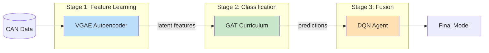
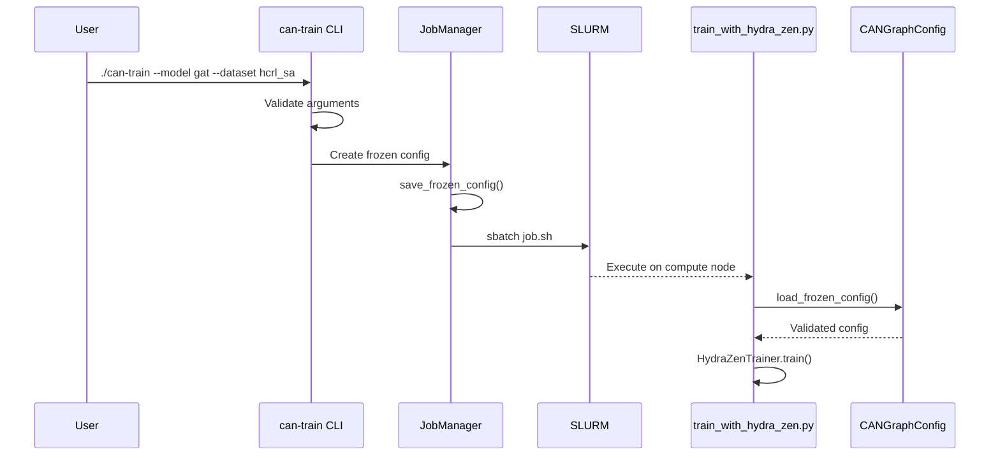
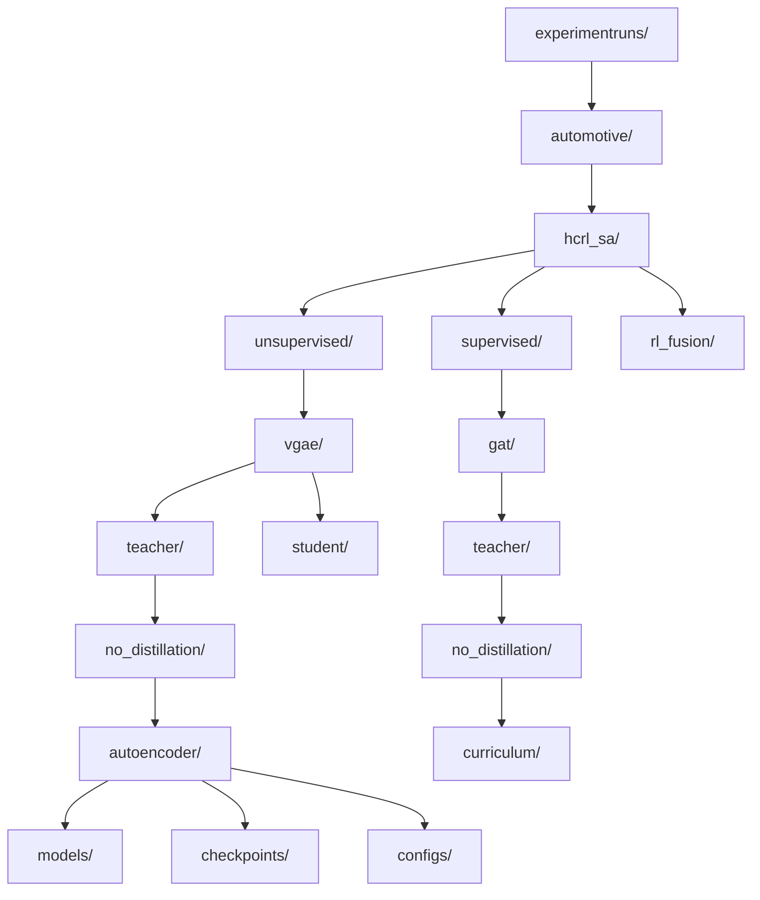

# Mermaid Diagram Implementation Plan

This document outlines the plan for adding Mermaid-based architecture diagrams to the KD-GAT project documentation.

## Overview

Mermaid is a JavaScript-based diagramming tool that renders Markdown-inspired text into diagrams. Key benefits:
- **Native GitHub rendering** - diagrams display directly in README/docs
- **Version-controlled** - diagrams live alongside code
- **Easy to maintain** - text-based, no external tools needed

## Priority Diagrams to Create

### 1. Training Pipeline Overview (HIGH PRIORITY)
**Location**: `docs/diagrams/training_pipeline.md`

**Purpose**: Show the three-stage pipeline (VGAE → GAT → DQN)



**Effort**: 1-2 hours

---

### 2. CLI Parameter Flow (HIGH PRIORITY)
**Location**: `docs/diagrams/parameter_flow.md`

**Purpose**: Show how parameters flow from CLI → SLURM → Training



**Effort**: 1-2 hours

---

### 3. Knowledge Distillation Architecture (MEDIUM PRIORITY)
**Location**: `docs/diagrams/knowledge_distillation.md`

**Purpose**: Show teacher-student relationship and KD losses

```mermaid
flowchart TB
    subgraph Teacher["Teacher Model (Frozen)"]
        T_VGAE[VGAE Teacher<br/>1.2M params]
        T_GAT[GAT Teacher<br/>1.1M params]
    end

    subgraph Student["Student Model (Training)"]
        S_VGAE[VGAE Student<br/>300K params]
        S_GAT[GAT Student<br/>250K params]
    end

    subgraph Losses
        KD[KD Loss<br/>α × soft_labels]
        Task[Task Loss<br/>(1-α) × hard_labels]
        Total[Combined Loss]
    end

    T_VGAE -->|soft latent z| KD
    T_GAT -->|soft logits| KD
    S_VGAE --> KD
    S_GAT --> KD
    S_VGAE --> Task
    S_GAT --> Task
    KD --> Total
    Task --> Total
    Total -->|backprop| S_VGAE
    Total -->|backprop| S_GAT
```

**Effort**: 2-3 hours

---

### 4. Experiment Directory Structure (MEDIUM PRIORITY)
**Location**: `docs/diagrams/directory_structure.md`

**Purpose**: Visualize the hierarchical folder structure



**Effort**: 1-2 hours

---

### 5. Model Architecture Diagrams (LOW PRIORITY)
**Location**: `docs/diagrams/models/`

Individual diagrams for VGAE, GAT, and DQN architectures.

**Effort**: 3-4 hours total

---

## Implementation Steps

### Step 1: Create Directory Structure (30 min)
```bash
mkdir -p docs/diagrams/models
touch docs/diagrams/README.md
touch docs/ARCHITECTURE.md
```

### Step 2: Create Training Pipeline Diagram (1-2 hours)
1. Create `docs/diagrams/training_pipeline.md`
2. Add the flowchart showing VGAE → GAT → DQN
3. Include notes explaining each stage
4. Link from main README

### Step 3: Create Parameter Flow Diagram (1-2 hours)
1. Create `docs/diagrams/parameter_flow.md`
2. Add sequence diagram showing CLI → SLURM → Training
3. Include the Frozen Config Pattern
4. Reference from `.claude/` docs

### Step 4: Create KD Architecture Diagram (2-3 hours)
1. Create `docs/diagrams/knowledge_distillation.md`
2. Show teacher-student relationship
3. Include loss computation flow
4. Add notes on α and temperature parameters

### Step 5: Create Directory Structure Diagram (1-2 hours)
1. Create `docs/diagrams/directory_structure.md`
2. Show experiment folder hierarchy
3. Include canonical path format
4. Reference from PROJECT_OVERVIEW.md

### Step 6: Create Main ARCHITECTURE.md (1 hour)
1. Create `docs/ARCHITECTURE.md` as entry point
2. Include embedded high-level diagram
3. Link to detailed diagrams in `docs/diagrams/`
4. Update README to link to architecture docs

---

## File Structure After Implementation

```
docs/
├── ARCHITECTURE.md              ← Main entry point
├── diagrams/
│   ├── README.md               ← Index of all diagrams
│   ├── training_pipeline.md    ← VGAE → GAT → DQN
│   ├── parameter_flow.md       ← CLI → SLURM → Training
│   ├── knowledge_distillation.md
│   ├── directory_structure.md
│   └── models/
│       ├── vgae_architecture.md
│       ├── gat_architecture.md
│       └── dqn_architecture.md
└── (existing docs...)
```

---

## Optional: Auto-Generated Diagrams via CI

### pydeps Integration
Auto-generate module dependency graphs:

```yaml
# .github/workflows/generate-diagrams.yml
name: Generate Architecture Diagrams

on:
  push:
    paths:
      - 'src/**/*.py'

jobs:
  generate-diagrams:
    runs-on: ubuntu-latest
    steps:
      - uses: actions/checkout@v4
      - name: Install pydeps
        run: pip install pydeps graphviz
      - name: Generate module dependency graph
        run: pydeps src --max-bacon=3 --cluster -o docs/diagrams/generated/module_deps.svg
      - name: Commit updated diagrams
        uses: stefanzweifel/git-auto-commit-action@v5
        with:
          commit_message: "docs: auto-update architecture diagrams"
```

**Effort**: 2-4 hours for CI setup

---

## Total Effort Estimate

| Task | Priority | Effort |
|------|----------|--------|
| Training Pipeline Diagram | HIGH | 1-2 hours |
| Parameter Flow Diagram | HIGH | 1-2 hours |
| KD Architecture Diagram | MEDIUM | 2-3 hours |
| Directory Structure Diagram | MEDIUM | 1-2 hours |
| Model Architecture Diagrams | LOW | 3-4 hours |
| Main ARCHITECTURE.md | HIGH | 1 hour |
| CI Integration (optional) | LOW | 2-4 hours |

**Minimum viable documentation**: 4-6 hours (HIGH priority items only)
**Complete documentation**: 12-18 hours (all items + CI)

---

## Recommended Starting Point

1. **Create `docs/ARCHITECTURE.md`** with embedded training pipeline diagram
2. **Create `docs/diagrams/parameter_flow.md`** showing Frozen Config Pattern
3. **Update README.md** to link to architecture docs
4. Iterate on other diagrams as needed

This gives immediate value (training pipeline + parameter flow) with minimal effort.

---

## Maintenance Guidelines

1. **Update diagrams when architecture changes** - treat them like code
2. **Keep diagrams simple** - one concept per diagram
3. **Use consistent colors**:
   - Blue (#bbdefb) for unsupervised/VGAE
   - Green (#c8e6c9) for supervised/GAT
   - Orange (#ffe0b2) for RL/DQN
4. **Test locally before committing** - use VS Code Mermaid preview extension
5. **Include notes explaining non-obvious flows**
