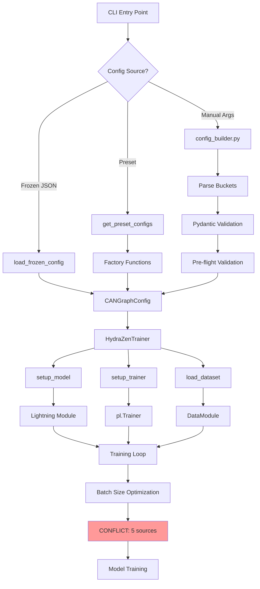
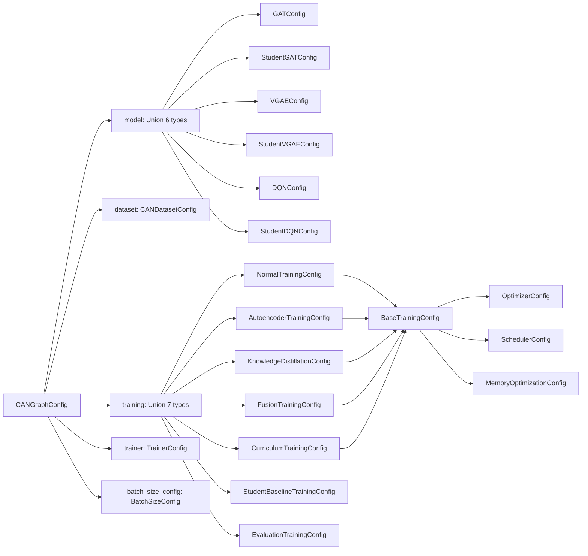
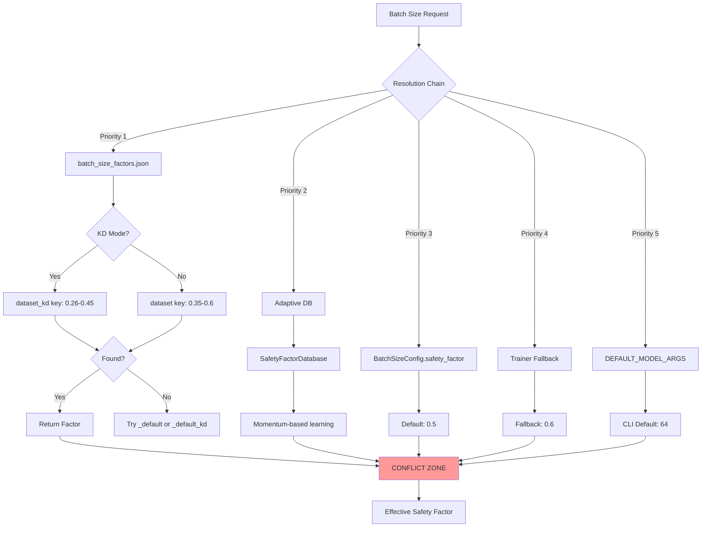
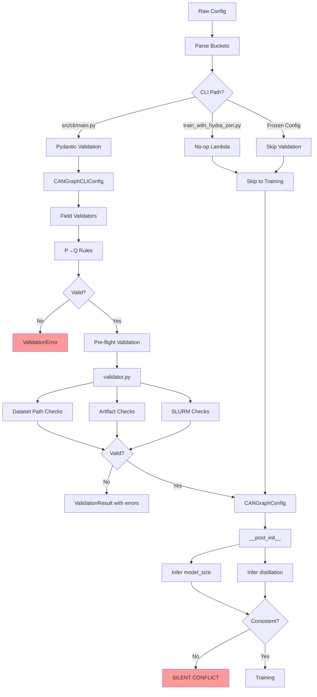
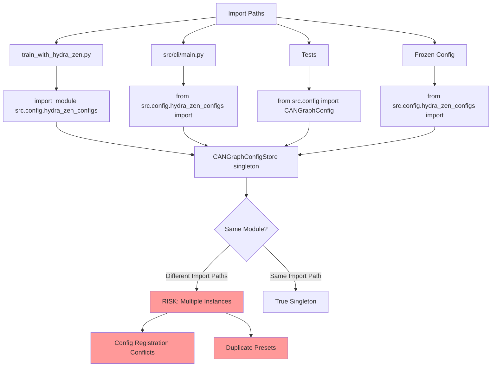

# KD-GAT Configuration System Analysis

**Date**: 2026-01-28
**Author**: Configuration Analysis Team
**Purpose**: Comprehensive analysis of configuration management, initialization patterns, pipeline impact, and conflict resolution

---

## Executive Summary

The KD-GAT project employs a **multi-layered configuration system** built on hydra-zen, consisting of **5 independent configuration sources**, **23 dataclass configurations**, and **3 separate validation systems**. This analysis identifies **10 major conflicts** arising from configuration source multiplicity and evaluates the hypothesis that relocating hydra-zen from `src/` to root-level would resolve these issues.

### Key Findings

**Configuration Sources (5 Total)**:
1. **Primary**: [`src/config/hydra_zen_configs.py`](src/config/hydra_zen_configs.py) (1090 lines, 23 dataclasses)
2. **Serialization**: [`src/config/frozen_config.py`](src/config/frozen_config.py) (283 lines, SLURM reproducibility)
3. **Batch Size Factors**: [`config/batch_size_factors.json`](config/batch_size_factors.json) (per-dataset safety factors)
4. **CLI Builder**: [`src/cli/config_builder.py`](src/cli/config_builder.py) (bucket parsing, parameter sweeps)
5. **Validators**: [`src/cli/pydantic_validators.py`](src/cli/pydantic_validators.py) + [`src/cli/validator.py`](src/cli/validator.py)

**Critical Conflicts Identified (10)**:
1. Batch size safety factors (5 conflicting sources)
2. Validation logic duplication (3 separate systems)
3. Duplicate dataset definitions (3 locations)
4. Learning rate defaults per mode (6 different values)
5. Model size inference (3 different implementations)
6. Distillation state inference (conflicting naming conventions)
7. Path resolution fallbacks (4 fallback chains)
8. Mode requirements validation (Pydantic vs runtime discrepancies)
9. Frozen config version checking (lenient, allows incompatible versions)
10. Import path inconsistencies (singleton pattern at risk)

**Hypothesis Evaluation**: **Partially Correct**
The user's hypothesis that "hydra-zen being within src/ is a critical error" correctly identifies a symptom, but misdiagnoses the root cause. The real problem is **configuration source multiplicity**—having 5 independent sources for overlapping configuration concerns creates conflicts that would persist regardless of hydra-zen's location.

**Verdict**: **Location is a symptom, not the disease**. The critical error is the **lack of a single source of truth** for each configuration concern.

**Recommendation**: **Consolidate configuration sources first**, then evaluate whether migration to base Hydra or relocating hydra-zen provides value. A migration without consolidation will simply move the conflicts to a different location.

---

## Table of Contents

1. [Configuration Architecture](#configuration-architecture)
2. [Configuration Sources Deep Dive](#configuration-sources-deep-dive)
3. [Configuration Flow Through Pipeline](#configuration-flow-through-pipeline)
4. [Summary Tables](#summary-tables)
5. [Mermaid Diagrams](#mermaid-diagrams)
6. [Conflict Analysis (10 Conflicts)](#conflict-analysis-10-conflicts)
7. [Hypothesis Evaluation](#hypothesis-evaluation)
8. [Recommendations](#recommendations)
9. [Consolidation Risk & Difficulty Matrix](#consolidation-risk--difficulty-matrix)
10. [Appendices](#appendices)

---

## Configuration Architecture

### Overview

The KD-GAT configuration system is a **type-safe, dataclass-based** architecture implemented via hydra-zen. Unlike traditional Hydra (YAML-based), this system defines all configurations programmatically in Python, providing IDE support, type checking, and runtime validation.

### Configuration Hierarchy

```
CANGraphConfig (root configuration object)
├── model: Union[GATConfig, StudentGATConfig, VGAEConfig, StudentVGAEConfig, DQNConfig, StudentDQNConfig]
├── dataset: CANDatasetConfig
├── training: Union[NormalTrainingConfig, AutoencoderTrainingConfig, KnowledgeDistillationConfig, ...]
├── trainer: TrainerConfig
└── batch_size_config: BatchSizeConfig
```

**Total Configuration Dataclasses**: 23
**Model Variants**: 6 (3 teacher architectures × 2 sizes each)
**Training Modes**: 7 (normal, autoencoder, knowledge_distillation, fusion, curriculum, student_baseline, evaluation)

### Entry Points

1. **[`train_with_hydra_zen.py`](train_with_hydra_zen.py)**: Main entry point for direct CLI execution
2. **[`src/cli/main.py`](src/cli/main.py)**: Unified CLI with explicit verbose argument structure
3. **Frozen Config Mode**: Load pre-validated configs from JSON (SLURM reproducibility)
4. **Preset Mode**: Use factory functions for common configurations

---

## Configuration Sources Deep Dive

### 1. Primary Configuration: `src/config/hydra_zen_configs.py`

**Location**: [`src/config/hydra_zen_configs.py`](src/config/hydra_zen_configs.py)
**Lines**: 1090
**Purpose**: Single source of truth for all dataclass definitions

**23 Dataclass Configurations**:

| Category | Dataclasses | Line Range | Purpose |
|----------|-------------|------------|---------|
| **Optimization** | `OptimizerConfig`, `SchedulerConfig` | 20-34 | Adam/SGD settings, LR scheduling |
| **Memory** | `MemoryOptimizationConfig`, `BatchSizeConfig` | 38-87 | Gradient checkpointing, batch size tuning |
| **Models** | `GATConfig`, `StudentGATConfig`, `VGAEConfig`, `StudentVGAEConfig`, `DQNConfig`, `StudentDQNConfig` | 95-253 | 6 model architecture configurations |
| **Dataset** | `BaseDatasetConfig`, `CANDatasetConfig` | 259-306 | CAN bus dataset specifications |
| **Training** | `BaseTrainingConfig`, `NormalTrainingConfig`, `AutoencoderTrainingConfig`, `KnowledgeDistillationConfig`, `StudentBaselineTrainingConfig`, `FusionTrainingConfig`, `CurriculumTrainingConfig`, `EvaluationTrainingConfig`, `FusionAgentConfig` | 313-566 | 9 training mode configurations |
| **Infrastructure** | `TrainerConfig`, `CANGraphConfig` | 573-611 | PyTorch Lightning, complete config |

**Key Components**:

- **`CANGraphConfigStore` (Lines 818-957)**: Singleton pattern managing configuration registration with hydra-zen's store
- **Factory Functions (Lines 964-1018)**: `create_gat_normal_config()`, `create_autoencoder_config()`, `create_distillation_config()`, `create_fusion_config()`, `create_curriculum_config()`
- **`CANGraphConfig.__post_init__()` (Lines 642-653)**: Auto-infers `model_size` and `distillation` state after initialization

**Example - GATConfig (Teacher Model)**:
```python
@dataclass
class GATConfig:
    """Graph Attention Network configuration (Teacher Model)."""
    type: str = "gat"
    input_dim: int = 11
    hidden_channels: int = 64
    output_dim: int = 2
    num_heads: int = 8
    num_layers: int = 5
    dropout: float = 0.3
    # Target: ~1.1M parameters
```

### 2. Frozen Configuration System: `src/config/frozen_config.py`

**Location**: [`src/config/frozen_config.py`](src/config/frozen_config.py)
**Lines**: 283
**Purpose**: Freeze configurations at job submission time for SLURM reproducibility

**Key Functions**:
- `config_to_dict()`: Converts `CANGraphConfig` → JSON-serializable dict
- `save_frozen_config()`: Saves config as JSON with metadata (`_frozen_config_version`, `_frozen_at`)
- `load_frozen_config()`: Reconstructs `CANGraphConfig` from JSON
- `dict_to_config()`: Recursive deserialization with type reconstruction

**Usage Pattern**:
```python
# At job submission
config = store.create_config(...)
save_frozen_config(config, "frozen_config.json")
# Submit SLURM job with: python train.py --frozen-config frozen_config.json

# At job start (compute node)
config = load_frozen_config("frozen_config.json")
trainer = HydraZenTrainer(config)
```

**Storage Location**:
- Runtime configs: `experimentruns/{modality}/{dataset}/.../configs/frozen_config_*.json`

**Issues**:
- Version check is lenient (warns but doesn't error on version mismatch)
- Incomplete type reconstruction if new config classes are added
- No validation that all fields were successfully reconstructed

### 3. Batch Size Safety Factors: `config/batch_size_factors.json`

**Location**: [`config/batch_size_factors.json`](config/batch_size_factors.json)
**Lines**: 23
**Purpose**: Per-dataset safety factors for batch size optimization (GPU memory management)

**Content**:
```json
{
  "hcrl_ch": 0.6,
  "hcrl_sa": 0.55,
  "set_01": 0.55,
  "set_02": 0.35,
  "set_03": 0.35,
  "set_04": 0.35,
  "_default": 0.5,

  "hcrl_ch_kd": 0.45,
  "hcrl_sa_kd": 0.41,
  "set_01_kd": 0.41,
  "set_02_kd": 0.26,
  "set_03_kd": 0.26,
  "set_04_kd": 0.26,
  "_default_kd": 0.38
}
```

**Resolution Logic**:
1. If KD mode: Try `{dataset}_kd` key
2. If not found: Try `{dataset}` key
3. If not found: Try `_default_kd` (KD) or `_default` (normal)
4. Final fallback: 0.5

**CONFLICT**: This is **Source 1** of 5 conflicting batch size factor sources (see [Conflict #1](#1-batch-size-safety-factors-5-conflicting-sources)).

### 4. CLI Configuration Builder: `src/cli/config_builder.py`

**Location**: [`src/cli/config_builder.py`](src/cli/config_builder.py)
**Lines**: 486
**Purpose**: Parse CLI arguments, build configurations from "bucket" syntax, support parameter sweeps

**Key Functions**:
- `parse_bucket()` (Line 60): Convert bucket strings like `"key=value,key2=[val1,val2]"` to dicts
- `expand_sweep()` (Line 118): Generate Cartesian product for parameter sweeps
- `merge_with_defaults()` (Line 217): Apply user values over `DEFAULT_MODEL_ARGS` with type conversion
- `create_can_graph_config()` (Line 308): Build complete `CANGraphConfig` from buckets

**DEFAULT_MODEL_ARGS (Lines 21-43)**:
```python
DEFAULT_MODEL_ARGS = {
    'epochs': 50,
    'learning_rate': 0.003,
    'batch_size': 64,
    'optimize_batch_size': False,
    'early_stopping_patience': 100,
    'gradient_checkpointing': True,
    'num_layers': None,  # Model-specific
    'hidden_channels': None,  # Model-specific
    'latent_dim': None,  # VGAE-specific
    # ... 9 more parameters
}
```

**CONFLICT**: These defaults can conflict with dataclass defaults in `hydra_zen_configs.py` (see [Conflict #3](#3-duplicate-dataset-definitions-3-locations)).

**Override Mechanism** (Lines 388-420):
```python
# Map model_args to training config fields
arg_mapping = {
    'epochs': 'max_epochs',
    'learning_rate': 'learning_rate',
    'batch_size': 'batch_size',
    'patience': 'early_stopping_patience',
    'optimize_batch_size': 'optimize_batch_size',
}

# Apply overrides
for key, value in model_args.items():
    if key in arg_mapping:
        config_key = arg_mapping[key]
        setattr(training_config, config_key, value)
```

### 5. Validation Systems: Pydantic + Pre-flight

#### 5a. Pydantic Validator: `src/cli/pydantic_validators.py`

**Location**: [`src/cli/pydantic_validators.py`](src/cli/pydantic_validators.py)
**Lines**: 185
**Purpose**: P→Q validation rules, prerequisite checking

**CANGraphCLIConfig Schema** (Lines 25-112):
- Enforces logical implications: `model=vgae` → `learning_type=unsupervised`
- Validates mode prerequisites: `mode=distillation` → `teacher_path` required
- Checks file existence for artifact paths
- Validates SLURM resource requirements

**P→Q Rules Enforced**:
1. `model in [vgae, vgae_student]` → `learning_type = unsupervised`
2. `model = dqn` → `learning_type = rl_fusion`
3. `model in [gat, gcn, gnn, graphsage]` → `learning_type = supervised`
4. `training_strategy = knowledge_distillation` → `teacher_model_path` required
5. `training_strategy = curriculum` → `vgae_model_path` required
6. `training_strategy = fusion` → `autoencoder_path` and `classifier_path` required

**CONFLICT**: Pydantic validation happens at CLI parsing, but `CANGraphConfig` (hydra-zen) doesn't enforce these rules at runtime (see [Conflict #2](#2-validation-logic-duplication-3-separate-systems)).

#### 5b. Pre-flight Validator: `src/cli/validator.py`

**Location**: [`src/cli/validator.py`](src/cli/validator.py)
**Lines**: 314
**Purpose**: File/artifact existence checks, SLURM resource validation

**Validation Layers** (Lines 95-200):
1. **Dataset Path Checks** (Lines 95-113): Verify `config.dataset.data_path` exists
2. **Required Artifacts Checks** (Lines 116-136): Verify teacher models, VGAE paths exist
3. **Output Directory Writability** (Lines 139+): Ensure experiment directory is writable
4. **SLURM Resource Validation**: Check memory/GPU requests are reasonable

**ValidationResult** (Lines 59-88):
```python
@dataclass
class ValidationResult:
    passed: bool
    errors: List[str]
    warnings: List[str]
    checks_passed: List[str]
```

**CONFLICT**: Duplicate validation logic with Pydantic (see [Conflict #2](#2-validation-logic-duplication-3-separate-systems)).

#### 5c. Runtime Validator: `train_with_hydra_zen.py` (NO-OP!)

**Location**: [`train_with_hydra_zen.py:51`](train_with_hydra_zen.py#L51)
**Code**:
```python
validate_config = getattr(_cfg_mod, 'validate_config', lambda cfg: True)
```

**ISSUE**: Falls back to a **no-op lambda** that always returns `True`! The actual validator in `src/cli/validator.py` is never imported or called by the main training script.

**Impact**: Training can proceed with invalid configurations when using `train_with_hydra_zen.py` directly (bypassing CLI).

---

## Configuration Flow Through Pipeline

### Entry Point Selection

```
┌─────────────────────────────────────────┐
│  Entry Point Selection                  │
├─────────────────────────────────────────┤
│ Frozen Config → Load from JSON          │
│ Preset Mode   → Get from preset dict    │
│ Manual Mode   → Build from CLI args     │
└──────────────┬──────────────────────────┘
               │
               ▼
```

1. **Frozen Config Mode** (`--frozen-config /path/to/config.json`):
   - Bypass all configuration building
   - Load pre-validated `CANGraphConfig` from JSON
   - Used for SLURM reproducibility

2. **Preset Mode** (`--preset gat_normal_hcrl_sa`):
   - Call `get_preset_configs()[preset_name]`
   - Factory functions create complete configs
   - Can be overridden by subsequent CLI args

3. **Manual Mode** (CLI args: `--model gat --dataset hcrl_sa --training normal`):
   - `config_builder.py` parses buckets
   - `CANGraphConfigStore.create_config()` builds config
   - Pydantic validation (if using `src/cli/main.py`)
   - Pre-flight validation (if enabled)

### Configuration Construction

```
┌─────────────────────────────────────────┐
│  Configuration Construction             │
├─────────────────────────────────────────┤
│ CANGraphConfigStore.create_config()     │
│ - Get model config (GATConfig, etc.)    │
│ - Get dataset config (CANDatasetConfig) │
│ - Get training config (NormalTraining...) │
│ - Merge with CLI overrides              │
│ - Apply model-specific overrides        │
└──────────────┬──────────────────────────┘
               │
               ▼
```

**Step-by-Step**:

1. **Component Retrieval**:
   ```python
   model_config = store.get_model_config("gat")  # Returns GATConfig()
   dataset_config = store.get_dataset_config("hcrl_sa")  # Returns CANDatasetConfig(name="hcrl_sa", ...)
   training_config = store.get_training_config("normal")  # Returns NormalTrainingConfig()
   trainer_config = TrainerConfig()
   ```

2. **Apply Overrides**:
   ```python
   if overrides:
       for key, value in overrides.items():
           if hasattr(training_config, key):
               setattr(training_config, key, value)
   ```

3. **Create CANGraphConfig**:
   ```python
   config = CANGraphConfig(
       model=model_config,
       dataset=dataset_config,
       training=training_config,
       trainer=trainer_config
   )
   ```

4. **Post-Init Inference** (`__post_init__`):
   ```python
   # Infer model_size from model type
   if self.model_size is None:
       self.model_size = "student" if "student" in self.model.type else "teacher"

   # Infer distillation state from teacher_model_path
   if self.distillation is None:
       self.distillation = "distilled" if self.training.teacher_model_path else "no_distillation"
   ```

### Validation Pipeline

```
┌─────────────────────────────────────────┐
│  Configuration Validation               │
├─────────────────────────────────────────┤
│ CANGraphConfig.__post_init__()          │
│ - Infer model_size (if None)            │
│ - Infer distillation state (if None)    │
│ - Generate experiment_name              │
├─────────────────────────────────────────┤
│ Pydantic Validation (CANGraphCLIConfig) │
│ - P→Q rule enforcement                  │
│ - Mode prerequisite checking            │
├─────────────────────────────────────────┤
│ Pre-flight Validation (validator.py)    │
│ - Dataset path checks                   │
│ - Artifact existence checks             │
│ - Directory writability checks          │
└──────────────┬──────────────────────────┘
               │
               ▼
```

**3 Validation Layers**:

1. **`__post_init__`** (Lines 642-653 in `hydra_zen_configs.py`): Auto-infer `model_size` and `distillation`
2. **Pydantic** (`pydantic_validators.py`): Enforce P→Q rules, check prerequisites
3. **Pre-flight** (`validator.py`): Verify file system state, SLURM resources

**CONFLICT**: These 3 layers have overlapping responsibilities and inconsistent behavior (see [Conflict #2](#2-validation-logic-duplication-3-separate-systems)).

### Component Initialization

```
┌─────────────────────────────────────────┐
│  Configuration Dispatch                 │
├─────────────────────────────────────────┤
│ HydraZenTrainer(config)                 │
│ └─→ Mode routing:                       │
│     ├─→ Fusion mode → FusionTrainer    │
│     ├─→ Curriculum → CurriculumTrainer │
│     └─→ Other → Standard training      │
└──────────────┬──────────────────────────┘
               │
               ▼
┌─────────────────────────────────────────┐
│  Component Initialization               │
├─────────────────────────────────────────┤
│ setup_model() → Lightning module        │
│ setup_trainer() → pl.Trainer            │
│ load_dataset() → Data loaders           │
│ _create_callbacks() → Checkpointing     │
│ _create_loggers() → MLFlow/TensorBoard  │
└──────────────┬──────────────────────────┘
               │
               ▼
```

**HydraZenTrainer Initialization** ([`src/training/trainer.py`](src/training/trainer.py)):

1. **setup_model()** (Lines 142-170):
   ```python
   if self.config.training.mode == "fusion":
       model = FusionLightningModule(asdict(self.config.training), num_ids)
   elif self.config.model.type in ["vgae", "vgae_student"]:
       model = VAELightningModule(cfg=self.config, num_ids=num_ids)
   elif self.config.model.type.startswith("gat"):
       model = GATLightningModule(cfg=self.config, num_ids=num_ids)
   ```

2. **setup_trainer()** (Lines 176-207):
   ```python
   trainer = pl.Trainer(
       max_epochs=self.config.training.max_epochs,
       accelerator=self.config.trainer.accelerator,
       devices=self.config.trainer.devices,
       precision=self.config.trainer.precision,
       callbacks=callbacks,
       logger=loggers,
   )
   ```

3. **load_dataset()**: Create DataModule with `config.dataset.data_path`, `config.training.batch_size`

4. **Batch Size Optimization** (Lines 72-120):
   ```python
   # CONFLICT ZONE: 5 sources for safety factor
   safety_factor = self._get_safety_factor()  # Tries JSON → Adaptive DB → Config → Fallback
   ```

### Training Execution

```
┌─────────────────────────────────────────┐
│  Training Execution                     │
├─────────────────────────────────────────┤
│ trainer.fit(model, datamodule)          │
│ - Config accessed throughout training   │
│ - Dynamic batch size tuning             │
│ - Early stopping monitoring             │
│ - Checkpoint saving                     │
└─────────────────────────────────────────┘
```

---

## Summary Tables

### Table 1: Configuration Sources

| Source | Location | Purpose | Lines | Dataclasses | Conflicts |
|--------|----------|---------|-------|-------------|-----------|
| **Primary Config** | [src/config/hydra_zen_configs.py](src/config/hydra_zen_configs.py) | All dataclass definitions | 1090 | 23 | Duplicate defaults |
| **Frozen Config** | [src/config/frozen_config.py](src/config/frozen_config.py) | Serialization for SLURM | 283 | 0 | Version validation |
| **Batch Factors** | [config/batch_size_factors.json](config/batch_size_factors.json) | Per-dataset safety factors | 23 | 0 | 5 sources conflict |
| **CLI Builder** | [src/cli/config_builder.py](src/cli/config_builder.py) | CLI parsing, defaults | 486 | 0 | Bypasses dataclasses |
| **Pydantic Validator** | [src/cli/pydantic_validators.py](src/cli/pydantic_validators.py) | P→Q rules | 185 | 1 | Different from runtime |
| **Pre-flight Validator** | [src/cli/validator.py](src/cli/validator.py) | File/artifact checks | 314 | 0 | Duplicate logic |

### Table 2: Configuration Dataclasses (23 Total)

| Name | Purpose | Dependencies | Default Conflicts |
|------|---------|--------------|-------------------|
| `OptimizerConfig` | Adam/SGD settings | None | lr=0.005 vs mode-specific |
| `SchedulerConfig` | LR scheduling | `OptimizerConfig` | - |
| `MemoryOptimizationConfig` | Gradient checkpointing | None | - |
| `BatchSizeConfig` | Batch size tuning | None | **5 conflicting sources** |
| `GATConfig` | Teacher GAT (~1.1M params) | None | - |
| `StudentGATConfig` | Student GAT (~55K params) | None | - |
| `VGAEConfig` | Teacher VGAE (~1.71M params) | None | - |
| `StudentVGAEConfig` | Student VGAE (~86K params) | None | - |
| `DQNConfig` | Teacher DQN (~687K params) | None | - |
| `StudentDQNConfig` | Student DQN (~32K params) | None | - |
| `BaseDatasetConfig` | Dataset base class | None | Duplicate paths |
| `CANDatasetConfig` | CAN dataset specifics | `BaseDatasetConfig` | **3 locations define paths** |
| `BaseTrainingConfig` | Common training settings | `Optimizer`, `Scheduler` | lr=0.003 |
| `NormalTrainingConfig` | Supervised training | `BaseTrainingConfig` | - |
| `AutoencoderTrainingConfig` | Unsupervised VGAE | `BaseTrainingConfig` | **lr=0.002** (conflicts with base) |
| `KnowledgeDistillationConfig` | Teacher→Student | `BaseTrainingConfig` | precision="16-mixed" |
| `StudentBaselineTrainingConfig` | Student-only | `BaseTrainingConfig` | **lr=0.001** (conflicts with base) |
| `FusionTrainingConfig` | Multi-model ensemble | `BaseTrainingConfig`, `FusionAgentConfig` | - |
| `FusionAgentConfig` | DQN agent config | None | - |
| `CurriculumTrainingConfig` | Hard mining | `BaseTrainingConfig` | patience=150 |
| `EvaluationTrainingConfig` | Evaluation mode | `BaseTrainingConfig` | - |
| `TrainerConfig` | PyTorch Lightning config | None | - |
| `CANGraphConfig` | Complete config | All above | Infers `model_size`/`distillation` |

### Table 3: Batch Size Safety Factor Sources (CONFLICT ZONE)

| Source | Location | Type | Priority | Example Values |
|--------|----------|------|----------|----------------|
| **JSON File** | [config/batch_size_factors.json](config/batch_size_factors.json) | Static per-dataset | **1 (Highest)** | `hcrl_sa: 0.55`, `set_02_kd: 0.26` |
| **Adaptive DB** | [src/training/adaptive_batch_size.py](src/training/adaptive_batch_size.py) | Learned factors | 2 | Momentum-based learning |
| **Config Dataclass** | `BatchSizeConfig.safety_factor` | Static default | 3 | `0.5` |
| **Code Comments** | [hydra_zen_configs.py:57-60](src/config/hydra_zen_configs.py#L57-L60) | Documentation | N/A | Curriculum: 0.90, KD: 0.75 **(conflicts!)** |
| **Trainer Fallback** | [trainer.py:809](src/training/trainer.py#L809) | Hardcoded | 4 | `0.6` |

### Table 4: Validation Layers (CONFLICT ZONE)

| Layer | File | Purpose | When Called | Issues |
|-------|------|---------|-------------|--------|
| **Pydantic** | [pydantic_validators.py](src/cli/pydantic_validators.py) | P→Q rules, prerequisites | CLI parsing | Different from runtime behavior |
| **Pre-flight** | [validator.py](src/cli/validator.py) | File/artifact checks | Before training | Duplicate logic with Pydantic |
| **Runtime** | [hydra_zen_configs.py:51](src/config/hydra_zen_configs.py#L51) | Config validation | `train_with_hydra_zen.py` | **Just a no-op lambda!** |
| **Post-init** | `CANGraphConfig.__post_init__` | Infer `model_size`/`distillation` | Object creation | **Inference done in 3 places** |

### Table 5: Critical Initialization Points

| Entry Point | Trigger | Configs Created | Flow | Issues |
|-------------|---------|-----------------|------|--------|
| [train_with_hydra_zen.py](train_with_hydra_zen.py) | CLI execution | `CANGraphConfig` via frozen or dynamic | Parse → Validate → Train | **Uses no-op validator** |
| [src/cli/main.py](src/cli/main.py) | Unified CLI | `CANGraphCLIConfig` (Pydantic) → `CANGraphConfig` | Parse → Pydantic → Pre-flight → Train | Different validation than runtime |
| **Frozen Config** | `--frozen-config` flag | Load from JSON | JSON → Deserialize → Train | **Lenient version check** |
| **Preset** | `--preset` flag | Factory functions | `get_preset_configs()` → Train | Hardcoded paths |
| **CANGraphConfigStore** | Singleton init | Register all 23 dataclasses | Lazy singleton → hydra-zen store | **Import path risks** |

---

## Mermaid Diagrams

### Diagram 1: Configuration Flow (Full Pipeline)



### Diagram 2: Configuration Dependencies



### Diagram 3: Batch Size Conflict Zone



### Diagram 4: Validation Conflicts



### Diagram 5: Hydra-Zen Location Issues



---

## Conflict Analysis (10 Conflicts)

### 1. Batch Size Safety Factors (5 Conflicting Sources)

**Severity**: **HIGH** - Can cause OOM crashes or GPU underutilization

**Sources**:

| # | Source | Location | Type | Value(s) |
|---|--------|----------|------|----------|
| 1 | JSON File | [config/batch_size_factors.json](config/batch_size_factors.json) | Static per-dataset | `hcrl_sa: 0.55`, `hcrl_sa_kd: 0.41`, `set_02: 0.35`, `set_02_kd: 0.26`, `_default: 0.5`, `_default_kd: 0.38` |
| 2 | Adaptive DB | [src/training/adaptive_batch_size.py](src/training/adaptive_batch_size.py) | Learned via momentum | Dynamic, targets 90% GPU utilization |
| 3 | Config Dataclass | [hydra_zen_configs.py:73](src/config/hydra_zen_configs.py#L73) | Static default | `safety_factor: float = 0.5` |
| 4 | Code Comments | [hydra_zen_configs.py:57-60](src/config/hydra_zen_configs.py#L57-L60) | Documentation | Curriculum: 0.90, KD: 0.75 **(conflicts with JSON!)** |
| 5 | Trainer Fallback | [trainer.py:809](src/training/trainer.py#L809) | Hardcoded | `static_factor = getattr(self.training, 'graph_memory_safety_factor', 0.6)` |

**Conflicts**:

- **Conflict 1a**: JSON specifies `hcrl_sa_kd: 0.41`, but code comments claim KD should use `0.75`
- **Conflict 1b**: JSON specifies `set_02_kd: 0.26`, but code comments claim KD should use `0.75`
- **Conflict 1c**: Code comments claim Curriculum uses `0.90`, but JSON has no curriculum-specific entry (falls back to `_default: 0.5`)
- **Conflict 1d**: Trainer fallback uses `0.6`, but `BatchSizeConfig` default is `0.5`
- **Conflict 1e**: Adaptive DB learns factors dynamically, potentially overriding JSON values

**Resolution Priority** (as implemented in [`trainer.py`](src/training/trainer.py)):
1. JSON file (if key found)
2. Adaptive DB (if `use_adaptive_batch_size_factor = True`)
3. `graph_memory_safety_factor` field (if set)
4. Trainer fallback (`0.6`)

**Recommendation**: **Make `config/batch_size_factors.json` the single source of truth**. Remove all other sources:
- Update code comments to match JSON values
- Remove hardcoded fallback in `trainer.py`
- Keep adaptive DB as an optional override (not a fallback)

### 2. Validation Logic Duplication (3 Separate Systems)

**Severity**: **CRITICAL** - Can allow invalid configs to reach training

**Systems**:

| # | System | File | Purpose | When Called |
|---|--------|------|---------|-------------|
| 1 | Pydantic | [pydantic_validators.py](src/cli/pydantic_validators.py) | P→Q rules, prerequisites | CLI parsing (`src/cli/main.py`) |
| 2 | Pre-flight | [validator.py](src/cli/validator.py) | File/artifact checks | Before training (optional) |
| 3 | Runtime | [train_with_hydra_zen.py:51](train_with_hydra_zen.py#L51) | Config validation | Main entry point |

**Conflicts**:

- **Conflict 2a**: Runtime validator is a **no-op lambda** (`lambda cfg: True`)
  - **Location**: [`train_with_hydra_zen.py:51`](train_with_hydra_zen.py#L51)
  - **Code**: `validate_config = getattr(_cfg_mod, 'validate_config', lambda cfg: True)`
  - **Impact**: Training can proceed with invalid configs when using `train_with_hydra_zen.py` directly

- **Conflict 2b**: Pydantic validates different fields than Pre-flight
  - **Pydantic**: Checks P→Q rules (`model=vgae` → `learning_type=unsupervised`)
  - **Pre-flight**: Checks file existence, SLURM resources
  - **Overlap**: Both check artifact paths, but with different error messages

- **Conflict 2c**: Pydantic validation only runs for `src/cli/main.py` entry point
  - **Bypassed by**: `train_with_hydra_zen.py`, frozen config mode, preset mode
  - **Impact**: Inconsistent validation behavior depending on entry point

**Recommendation**: **Unify validation into `src/cli/validator.py`**:
1. Import and call `validate_config()` from `validator.py` in `train_with_hydra_zen.py`
2. Move P→Q rules from Pydantic into `validator.py`
3. Make validation **mandatory** for all entry points (except frozen config)

### 3. Duplicate Dataset Definitions (3 Locations)

**Severity**: **MEDIUM** - Makes updates error-prone

**Locations**:

| # | Location | Purpose | Code |
|---|----------|---------|------|
| 1 | [hydra_zen_configs.py:866-873](src/config/hydra_zen_configs.py#L866-L873) | `CANGraphConfigStore._register_presets()` | `CANDatasetConfig(name="hcrl_sa", data_path="data/automotive/hcrl_sa")` |
| 2 | [hydra_zen_configs.py:929-936](src/config/hydra_zen_configs.py#L929-L936) | `CANGraphConfigStore.get_dataset_config()` | `CANDatasetConfig(name="hcrl_sa", data_path="data/automotive/hcrl_sa")` |
| 3 | [src/config/__main__.py:48-61](src/config/__main__.py#L48-L61) | CLI `list-configs` command | Hardcoded string descriptions |

**Conflict**: When a dataset path changes, all 3 locations must be updated. Changes to one may not propagate.

**Example**:
```python
# Location 1: _register_presets()
"hcrl_sa": CANDatasetConfig(name="hcrl_sa", data_path="data/automotive/hcrl_sa"),

# Location 2: get_dataset_config()
"hcrl_sa": CANDatasetConfig(name="hcrl_sa", data_path="data/automotive/hcrl_sa"),

# Location 3: __main__.py
"Available datasets: hcrl_sa (data/automotive/hcrl_sa), ..."
```

**Recommendation**: **Define datasets in a single location** (e.g., `DATASETS` dict at module level), reference everywhere:
```python
# Single source of truth
DATASETS = {
    "hcrl_sa": CANDatasetConfig(name="hcrl_sa", data_path="data/automotive/hcrl_sa"),
    "hcrl_ch": CANDatasetConfig(name="hcrl_ch", data_path="data/automotive/hcrl_ch"),
    # ...
}

# _register_presets() references DATASETS
for name, config in DATASETS.items():
    self.store(config, name=name, group="dataset")

# get_dataset_config() references DATASETS
return DATASETS[dataset_name]
```

### 4. Learning Rate Defaults Per Mode (6 Different Values)

**Severity**: **MEDIUM** - Can cause suboptimal training

**Defaults**:

| Mode | File | Line | Default LR | Conflicts |
|------|------|------|------------|-----------|
| **Base** | [hydra_zen_configs.py:318](src/config/hydra_zen_configs.py#L318) | `BaseTrainingConfig` | `0.003` | - |
| **Optimizer** | [hydra_zen_configs.py:24](src/config/hydra_zen_configs.py#L24) | `OptimizerConfig` | `0.005` | Conflicts with Base |
| **Normal** | [hydra_zen_configs.py:318](src/config/hydra_zen_configs.py#L318) | `NormalTrainingConfig` | `0.003` (inherited) | - |
| **Autoencoder** | [hydra_zen_configs.py:413](src/config/hydra_zen_configs.py#L413) | `AutoencoderTrainingConfig` | `0.002` | Conflicts with Base |
| **KD** | [hydra_zen_configs.py:436](src/config/hydra_zen_configs.py#L436) | `KnowledgeDistillationConfig` | `0.003` (inherited) | - |
| **Student Baseline** | [hydra_zen_configs.py:457](src/config/hydra_zen_configs.py#L457) | `StudentBaselineTrainingConfig` | `0.001` | Conflicts with Base |
| **CLI Default** | [config_builder.py:22](src/cli/config_builder.py#L22) | `DEFAULT_MODEL_ARGS` | `0.003` | - |

**Conflict**: `OptimizerConfig` has `lr=0.005`, but all training modes use `learning_rate=0.003` (or lower). Which takes precedence?

**Resolution**: Training config's `learning_rate` is passed to optimizer during `configure_optimizers()`, so training config wins. But `OptimizerConfig.lr` is misleading.

**Recommendation**: **Remove `lr` from `OptimizerConfig`** (it's unused). Keep learning rate only in training configs.

### 5. Model Size Inference (3 Different Locations)

**Severity**: **MEDIUM** - Can cause inconsistent experiment directory paths

**Implementations**:

| # | Location | Code |
|---|----------|------|
| 1 | [hydra_zen_configs.py:648-649](src/config/hydra_zen_configs.py#L648-L649) | `if self.model_size is None: self.model_size = "student" if "student" in getattr(self.model, "type", "") else "teacher"` |
| 2 | [hydra_zen_configs.py:666](src/config/hydra_zen_configs.py#L666) | `model_size = self.model_size or ("student" if "student" in raw_type else "teacher")` |
| 3 | [pydantic_validators.py](src/cli/pydantic_validators.py) | Validates `model_size` as explicit field |

**Conflict**: Inference is done in `__post_init__` (Location 1) and again in `canonical_experiment_dir()` (Location 2). Pydantic expects `model_size` to be explicit.

**Recommendation**: **Consolidate to `__post_init__` only**. Remove inference from `canonical_experiment_dir()`.

### 6. Distillation State Inference (Conflicting Naming)

**Severity**: **LOW** - Confusing but functional

**Naming Conventions**:

| Location | Field Name | Values |
|----------|------------|--------|
| `CANGraphConfig` | `distillation: str` | `"distilled"`, `"no_distillation"` |
| `BaseTrainingConfig` | `use_knowledge_distillation: bool` | `True`, `False` |
| Pydantic CLI | `--distillation` | `"with-kd"`, `"no-kd"` |
| Canonical Path | `distillation` | `"distilled"`, `"no_distillation"` |

**Conflict**: Three different naming schemes for the same concept.

**Inference** (Lines 652-653):
```python
if self.distillation is None:
    self.distillation = "distilled" if getattr(self.training, "teacher_model_path", None) else "no_distillation"
```

**Recommendation**: **Standardize to `distillation: bool`** with values `True`/`False`. Update canonical path to use `"with_distillation"`/`"no_distillation"`.

### 7. Path Resolution Fallbacks (4 Fallback Chains)

**Severity**: **MEDIUM** - Can silently return paths that don't exist

**Fallback Chains**:

1. **Teacher Model Path** ([hydra_zen_configs.py:717-733](src/config/hydra_zen_configs.py#L717-L733)):
   ```python
   discovered = resolver.discover_model(vgae_dir, 'vgae', require_exists=False)
   artifacts["teacher_model"] = discovered or (vgae_dir / "models" / "vgae_autoencoder.pth")
   ```
   - **Issue**: Returns path even if `discovered is None` and fallback doesn't exist

2. **Autoencoder Path** (Fusion mode):
   - Tries glob discovery
   - Falls back to hardcoded default
   - No validation that fallback exists

3. **VGAE Path** (Curriculum mode):
   - Similar to teacher model path
   - 4 different discovery attempts before fallback

4. **Dataset Path**:
   - Constructed from `data_path` field
   - No fallback, but `__post_init__` tries to infer from `cache_dir`

**Recommendation**: **Fail fast if paths don't exist**. Set `require_exists=True` in discovery, raise error if not found.

### 8. Mode Requirements Validation (Pydantic vs Runtime)

**Severity**: **HIGH** - Pydantic enforces rules that runtime doesn't

**Pydantic Rules** ([pydantic_validators.py](src/cli/pydantic_validators.py)):
```python
# P→Q Rules
if learning_type == "unsupervised" and v != "autoencoder":
    raise ValueError(...)

if model in ["vgae", "vgae_student"] and learning_type != "unsupervised":
    raise ValueError(...)
```

**Runtime Behavior**: No enforcement of P→Q rules in `CANGraphConfig`

**Example Conflict**:
- CLI (`src/cli/main.py`): `--model vgae --learning-type supervised` → ValidationError
- Direct (`train_with_hydra_zen.py`): `model="vgae", learning_type="supervised"` → **Allowed!**

**Recommendation**: **Move P→Q rules into `CANGraphConfig.__post_init__`** so they're enforced regardless of entry point.

### 9. Frozen Config Version Checking (Lenient)

**Severity**: **MEDIUM** - Old configs can load with wrong values

**Code** ([frozen_config.py:239-242](src/config/frozen_config.py#L239-L242)):
```python
version = config_dict.get('_frozen_config_version', '0.0')
if not version.startswith('1.'):
    logger.warning(f"Frozen config version {version} may not be compatible")
```

**Issue**: Only warns, doesn't error. Old frozen configs will silently load with potentially incompatible schemas.

**Recommendation**: **Raise error on version mismatch**:
```python
if not version.startswith('1.'):
    raise ValueError(f"Incompatible frozen config version {version}, expected 1.x")
```

### 10. Import Path Inconsistencies (Singleton at Risk)

**Severity**: **MEDIUM** - Can break singleton pattern

**Import Variations**:

| File | Import Statement |
|------|------------------|
| [train_with_hydra_zen.py:44](train_with_hydra_zen.py#L44) | `_cfg_mod = import_module('src.config.hydra_zen_configs')` |
| [src/cli/main.py](src/cli/main.py) | `from src.config.hydra_zen_configs import CANGraphConfig` |
| Tests | `from src.config import CANGraphConfig` |
| [frozen_config.py](src/config/frozen_config.py) | `from src.config.hydra_zen_configs import CANGraphConfig` |

**Issue**: Python can load the same module twice if imported via different paths (e.g., `src.config.hydra_zen_configs` vs `src.config`). This breaks the `CANGraphConfigStore` singleton.

**Recommendation**: **Standardize all imports to `from src.config.hydra_zen_configs import ...`**. Add to `src/config/__init__.py`:
```python
from src.config.hydra_zen_configs import CANGraphConfig, CANGraphConfigStore
```

---

## Hypothesis Evaluation

### User's Hypothesis

> "Hydra-zen being within src/ is a critical error, and migrating to base Hydra will allow all configurations to start at the top/config file under root and waterfall down the pipeline."

### Analysis

#### Part 1: "Hydra-zen being within src/ is a critical error"

**Assessment**: **Partially Correct**

**Issues Caused by src/ Location**:

1. **Import Path Inconsistencies** ([Conflict #10](#10-import-path-inconsistencies-singleton-at-risk)):
   - Different import paths (`src.config.hydra_zen_configs` vs `src.config`) risk breaking singleton
   - Tests may import differently than production code
   - **Severity**: Medium - Can cause subtle bugs

2. **Configuration Coupling to Source Code**:
   - Config changes require source code modifications
   - Can't hot-swap configs without redeploying code
   - **Severity**: Low - Frozen configs already mitigate this

3. **SLURM Reproducibility Friction**:
   - Frozen config system exists specifically to work around src/ location
   - Wouldn't need frozen configs if configs were external
   - **Severity**: Low - Frozen configs work well

**Non-Issues (Not Caused by src/ Location)**:

1. **Batch Size Conflicts** ([Conflict #1](#1-batch-size-safety-factors-5-conflicting-sources)):
   - 5 conflicting sources exist **regardless of hydra-zen location**
   - JSON file is already in `config/` (root-level)
   - **Verdict**: Location is irrelevant

2. **Validation Duplication** ([Conflict #2](#2-validation-logic-duplication-3-separate-systems)):
   - 3 separate validation systems exist **regardless of config location**
   - Pydantic and Pre-flight validators are in `src/cli/`
   - **Verdict**: Location is irrelevant

3. **Duplicate Definitions** ([Conflict #3](#3-duplicate-dataset-definitions-3-locations)):
   - Dataset definitions duplicated **within the same file**
   - Has nothing to do with file location
   - **Verdict**: Location is irrelevant

**Verdict on Part 1**: The src/ location contributes to **1 real issue (import paths)** and **2 minor frictions (coupling, SLURM)**. It is **not the root cause** of the 10 major conflicts identified.

#### Part 2: "Migrating to base Hydra will allow all configurations to start at the top/config file under root and waterfall down the pipeline"

**Assessment**: **Incorrect**

**What Base Hydra Would Change**:

1. **Configuration Format**: YAML instead of Python dataclasses
2. **Configuration Location**: `config/` directory at root instead of `src/config/`
3. **Composition**: Hydra's built-in composition instead of Python factory functions

**What Base Hydra Would NOT Change**:

1. **Batch Size Conflicts**: JSON file is already at root. Moving Python configs to root doesn't eliminate the 5 conflicting sources.
2. **Validation Duplication**: Pydantic and Pre-flight validators are separate systems. Hydra has no built-in validation beyond YAML syntax.
3. **Duplicate Definitions**: Would need to duplicate dataset configs in YAML **and** maintain Python dataclasses for type checking.
4. **Learning Rate Conflicts**: Each training mode would still define its own LR in YAML.
5. **Path Resolution**: Fallback chains are logic, not configuration location.

**Migration Would Introduce New Issues**:

1. **Type Safety Loss**: YAML has no type checking. Current system catches errors at IDE/import time; YAML catches errors at runtime.
2. **Duplicate Maintenance**: Need both YAML (configs) and Python (dataclasses for Lightning modules).
3. **Validation Gap**: Pydantic validators work with Python objects, not YAML. Would need to rewrite all validators.
4. **Breaking Change**: Frozen config serialization, factory functions, all need rewriting.

**Verdict on Part 2**: Migration to base Hydra would **not solve the identified conflicts** and would **introduce new maintenance overhead**.

### Root Cause Diagnosis

The real problem is **configuration source multiplicity**: **5+ independent sources** for overlapping configuration concerns.

| Concern | Sources | Correct Approach |
|---------|---------|------------------|
| **Batch Size Safety Factors** | 5 (JSON, adaptive DB, config default, comments, fallback) | **1 source**: `config/batch_size_factors.json` |
| **Validation** | 3 (Pydantic, Pre-flight, runtime no-op) | **1 system**: `src/cli/validator.py` (called everywhere) |
| **Dataset Paths** | 3 (presets, get_dataset_config, __main__) | **1 dict**: `DATASETS` referenced by all |
| **Learning Rates** | 6 (base, optimizer, each mode) | **1 per mode**: Remove `OptimizerConfig.lr` |
| **Model Size** | 3 (post_init, canonical_dir, pydantic) | **1 location**: `__post_init__` only |

### Recommendation

**Phase 1: Consolidate Sources (Required)**
1. **Batch Size**: Make `config/batch_size_factors.json` the single source. Remove all others.
2. **Validation**: Make `src/cli/validator.py` the single validator. Call it from all entry points.
3. **Dataset Paths**: Single `DATASETS` dict, referenced everywhere.
4. **Learning Rates**: Mode-specific configs only. Remove `OptimizerConfig.lr`.
5. **Inferences**: Consolidate to `__post_init__` only.

**Phase 2: Then Evaluate Location/Migration (Optional)**

After Phase 1:
- **Assess if src/ location is still problematic**
  - Standardize import paths: `from src.config.hydra_zen_configs import ...`
  - Add exports to `src/config/__init__.py`
  - If imports are clean, **location is fine**

- **Consider migration to base Hydra only if**:
  - Need runtime config changes without redeployment
  - Want Hydra's built-in composition features
  - Type safety is not critical

**Alternative: Keep Hydra-Zen, Fix Structure**
- Consolidate sources (Phase 1)
- Standardize imports
- Document configuration precedence
- Add validation tests to catch conflicts
- **Result**: Clean system without migration overhead

### Verdict

**Hypothesis is partially correct but misdiagnoses the root cause.**

- ✅ **Correct**: Hydra-zen's location in `src/` creates some issues (import paths, coupling)
- ❌ **Incorrect**: Location is the **symptom**, not the **disease**
- ❌ **Incorrect**: Migration to base Hydra would **not solve** the 10 identified conflicts
- ✅ **Correct Path**: **Consolidate configuration sources first**, then evaluate location/migration

**Bottom Line**: **Location is a red herring. Fix the multiplicity problem.**

---

## Recommendations

### Immediate Actions (Required)

#### 1. Consolidate Batch Size Safety Factors

**Problem**: 5 conflicting sources ([Conflict #1](#1-batch-size-safety-factors-5-conflicting-sources))

**Action**:
- Make [`config/batch_size_factors.json`](config/batch_size_factors.json) the **single source of truth**
- Remove hardcoded values from code comments (lines 57-60 in `hydra_zen_configs.py`)
- Remove trainer fallback (`0.6` in `trainer.py:809`)
- Keep adaptive DB as **optional override** (not fallback)
- Update resolution logic to: JSON → Adaptive (if enabled) → Error (if not found)

**Files to Modify**:
- [`src/config/hydra_zen_configs.py`](src/config/hydra_zen_configs.py): Remove conflicting comments
- [`src/training/trainer.py`](src/training/trainer.py): Remove fallback, make JSON mandatory
- [`config/batch_size_factors.json`](config/batch_size_factors.json): Add curriculum-specific entries

**Impact**: Eliminates 5→1 sources, predictable batch size behavior

#### 2. Unify Validation Logic

**Problem**: 3 separate validation systems, runtime is no-op ([Conflict #2](#2-validation-logic-duplication-3-separate-systems))

**Action**:
- Import `validate_config()` from `src/cli/validator.py` in `train_with_hydra_zen.py`
- Replace no-op lambda (line 51) with actual validator
- Move P→Q rules from Pydantic into `validator.py`
- Make validation **mandatory** for all entry points (except frozen config)

**Files to Modify**:
- [`train_with_hydra_zen.py:51`](train_with_hydra_zen.py#L51): `from src.cli.validator import validate_config`
- [`src/cli/validator.py`](src/cli/validator.py): Add P→Q rule checks
- [`src/cli/pydantic_validators.py`](src/cli/pydantic_validators.py): Remove duplicate logic, delegate to `validator.py`

**Impact**: Consistent validation across all entry points

#### 3. Consolidate Dataset Definitions

**Problem**: Duplicate definitions in 3 locations ([Conflict #3](#3-duplicate-dataset-definitions-3-locations))

**Action**:
- Define `DATASETS` dict at module level in `hydra_zen_configs.py`
- Reference `DATASETS` from `_register_presets()`, `get_dataset_config()`, `__main__.py`

**Example**:
```python
# Single source of truth (add after line 306)
DATASETS = {
    "hcrl_sa": CANDatasetConfig(name="hcrl_sa", data_path="data/automotive/hcrl_sa"),
    "hcrl_ch": CANDatasetConfig(name="hcrl_ch", data_path="data/automotive/hcrl_ch"),
    "set_01": CANDatasetConfig(name="set_01", data_path="data/automotive/set_01"),
    "set_02": CANDatasetConfig(name="set_02", data_path="data/automotive/set_02"),
    "set_03": CANDatasetConfig(name="set_03", data_path="data/automotive/set_03"),
    "set_04": CANDatasetConfig(name="set_04", data_path="data/automotive/set_04"),
}

# _register_presets() references DATASETS
for name, config in DATASETS.items():
    self.store(config, name=name, group="dataset")

# get_dataset_config() references DATASETS
return DATASETS[dataset_name]
```

**Impact**: 3→1 definitions, easier maintenance

#### 4. Remove Conflicting Learning Rate Defaults

**Problem**: 6 different LR defaults ([Conflict #4](#4-learning-rate-defaults-per-mode-6-different-values))

**Action**:
- Remove `lr` from `OptimizerConfig` (line 24)
- Keep `learning_rate` only in training configs
- Document that training config's LR is passed to optimizer

**Impact**: Eliminates misleading default, clear precedence

### Short-Term Improvements (Recommended)

#### 5. Consolidate Model Size Inference

**Problem**: 3 different implementations ([Conflict #5](#5-model-size-inference-3-different-locations))

**Action**:
- Keep inference only in `__post_init__` (lines 648-649)
- Remove inference from `canonical_experiment_dir()` (line 666)
- Assume `model_size` is always set after `__post_init__`

**Impact**: Single source of truth for inference

#### 6. Standardize Distillation Naming

**Problem**: 3 different naming schemes ([Conflict #6](#6-distillation-state-inference-conflicting-naming))

**Action**:
- Standardize to `distillation: bool` with values `True`/`False`
- Update canonical path to use `"with_distillation"`/`"no_distillation"`
- Update CLI to accept `--distillation` flag (boolean)

**Impact**: Consistent naming across codebase

#### 7. Fail Fast on Path Resolution

**Problem**: 4 fallback chains that silently return non-existent paths ([Conflict #7](#7-path-resolution-fallbacks-4-fallback-chains))

**Action**:
- Set `require_exists=True` in all `discover_model()` calls
- Raise error immediately if artifact not found
- Remove fallback paths (they mask configuration errors)

**Impact**: Explicit errors instead of silent failures

#### 8. Enforce P→Q Rules at Runtime

**Problem**: Pydantic enforces rules that runtime doesn't ([Conflict #8](#8-mode-requirements-validation-pydantic-vs-runtime))

**Action**:
- Move P→Q rules into `CANGraphConfig.__post_init__`
- Raise `ValueError` if rules violated
- Remove duplicate checks from Pydantic

**Example**:
```python
def __post_init__(self):
    # Existing inference logic
    # ...

    # P→Q rule enforcement
    if self.model.type in ["vgae", "vgae_student"] and self.training.mode != "autoencoder":
        raise ValueError(f"Model {self.model.type} requires training mode 'autoencoder', got {self.training.mode}")

    if self.training.mode == "knowledge_distillation" and not getattr(self.training, "teacher_model_path", None):
        raise ValueError("Knowledge distillation mode requires teacher_model_path")
```

**Impact**: Consistent validation regardless of entry point

#### 9. Strict Frozen Config Version Checking

**Problem**: Lenient version check allows incompatible configs ([Conflict #9](#9-frozen-config-version-checking-lenient))

**Action**:
- Change warning to error in `load_frozen_config()` (line 242)
- Bump version to `1.1` when making breaking changes
- Document version compatibility matrix

**Impact**: Prevents silent incompatibilities

#### 10. Standardize Import Paths

**Problem**: Import path inconsistencies risk breaking singleton ([Conflict #10](#10-import-path-inconsistencies-singleton-at-risk))

**Action**:
- Standardize all imports to `from src.config.hydra_zen_configs import ...`
- Add exports to `src/config/__init__.py`:
  ```python
  from src.config.hydra_zen_configs import CANGraphConfig, CANGraphConfigStore
  ```
- Update all files to use consistent import path

**Impact**: Preserves singleton pattern

### Long-Term Strategy (Optional)

#### 11. Document Configuration Precedence

**Action**:
- Create `docs/configuration_precedence.md`
- Document resolution order for each configuration concern
- Include examples and flowcharts

**Impact**: Developers understand override behavior

#### 12. Create Configuration Registry

**Action**:
- Centralized registry tracking all config sources
- Validation that ensures no conflicts
- CLI tool to inspect config resolution

**Impact**: Proactive conflict detection

#### 13. Add Configuration Testing Suite

**Action**:
- Unit tests for each config dataclass
- Integration tests for configuration resolution
- Conflict detection tests (fail if new source added)

**Impact**: Catches conflicts before they reach production

#### 14. Evaluate Migration (Only After Consolidation)

**Action**:
- After completing all consolidation (1-10)
- Assess if hydra-zen location is still problematic
- Consider migration to base Hydra **only if** runtime config changes are needed

**Impact**: Informed decision based on clean system

---

## Consolidation Risk & Difficulty Matrix

This section provides a detailed risk and difficulty assessment for each of the 10 consolidation recommendations, enabling prioritized implementation based on impact and effort.

### Overview

Each consolidation is analyzed across four dimensions:
1. **Risk to Codebase** (Low/Medium/High/Critical) - Potential impact of errors or regressions
2. **Difficulty** (Easy/Medium/Hard/Very Hard) - Implementation complexity and effort
3. **Dependencies** - Other systems or components affected
4. **Rollback Plan** - Strategy for reverting if issues arise

### Risk-Difficulty Summary Table

| # | Consolidation | Risk | Difficulty | Est. Effort | Priority |
|---|---------------|------|------------|-------------|----------|
| **#2** | **Validation Logic (3 → 1)** | 🔴 **CRITICAL** | 🔴 **HARD** | 4-5 days | **P0** |
| **#1** | **Batch Size Factors (5 → 1)** | 🟠 **HIGH** | 🟡 **MEDIUM** | 2-3 days | **P1** |
| **#8** | **P→Q Runtime Rules** | 🟠 **HIGH** | 🔴 **HARD** | 3-4 days | **P1** |
| #5 | Model Size Inference (3 → 1) | 🟡 MEDIUM | 🟡 MEDIUM | 1 day | P2 |
| #7 | Path Resolution Fallbacks | 🟡 MEDIUM | 🟡 MEDIUM | 2 days | P2 |
| #10 | Import Path Standardization | 🟡 MEDIUM | 🟢 EASY | 1-2 hours | **Quick Win** |
| #4 | Learning Rate Defaults (6 → 4) | 🟡 MEDIUM | 🟢 EASY | 2-3 hours | **Quick Win** |
| #6 | Distillation Naming (3 → 1) | 🟢 LOW | 🟡 MEDIUM | 2 days | P3 |
| #3 | Dataset Definitions (3 → 1) | 🟢 LOW | 🟢 EASY | 1-2 hours | **Quick Win** |
| #9 | Frozen Config Version Check | 🟢 LOW | 🟢 EASY | 1 hour | **Quick Win** |

**Legend**:
- 🔴 CRITICAL/HARD - Highest priority, requires extensive planning
- 🟠 HIGH - Significant impact, careful implementation needed
- 🟡 MEDIUM - Moderate impact/effort
- 🟢 LOW/EASY - Low risk, straightforward to implement

---

### Detailed Breakdown

#### Conflict #1: Batch Size Safety Factors (5 sources → 1)

**Risk Level**: 🟠 **HIGH**

**Risk Analysis**:
- **GPU Memory Failures**: Incorrect safety factors can cause OOM crashes, terminating long-running training jobs
- **Broad Impact**: Affects ALL training runs across ALL datasets and modes
- **Non-Recoverable**: GPU memory failures mid-training waste hours of compute time
- **Data Loss**: Can lose partially trained models if not checkpointed recently
- **Silent Errors**: Wrong factors may underutilize GPU (performance loss) without obvious failures

**Difficulty Level**: 🟡 **MEDIUM**

**Implementation Complexity**:
- **Files to Modify**: 5 locations
  1. [`config/batch_size_factors.json`](config/batch_size_factors.json) - Make source of truth
  2. [`src/config/hydra_zen_configs.py:57-60`](src/config/hydra_zen_configs.py#L57-L60) - Remove conflicting comments
  3. [`src/training/trainer.py:809`](src/training/trainer.py#L809) - Remove hardcoded fallback
  4. [`src/training/adaptive_batch_size.py`](src/training/adaptive_batch_size.py) - Make optional override
  5. [`src/cli/config_builder.py`](src/cli/config_builder.py) - Remove DEFAULT_MODEL_ARGS conflicts

- **Testing Requirements**:
  - All datasets (6 total): hcrl_sa, hcrl_ch, set_01-04
  - All modes (7 total): normal, autoencoder, KD, fusion, curriculum, student_baseline, evaluation
  - KD variants (test `dataset_kd` keys)
  - Edge cases: missing dataset key (fallback to `_default`)

- **Backward Compatibility**:
  - Need migration path for existing frozen configs
  - Old frozen configs may have `tuned_batch_size` from different resolution logic
  - Update frozen config serialization to include safety factor source

**Dependencies**:
- Adaptive batch size system ([`src/training/adaptive_batch_size.py`](src/training/adaptive_batch_size.py))
- Trainer initialization ([`src/training/trainer.py`](src/training/trainer.py))
- Lightning batch size tuner

**Rollback Plan**:
1. Keep [`config/batch_size_factors.json`](config/batch_size_factors.json) unchanged
2. Revert code changes to restore multiple sources
3. Add feature flag: `USE_SINGLE_BATCH_FACTOR_SOURCE=false` (default false initially)
4. Monitor for 1 week, then flip to true

**Estimated Effort**: 2-3 days
- Day 1: Remove conflicting sources, update resolution logic
- Day 2: Comprehensive testing (all dataset × mode combinations)
- Day 3: Migration path for frozen configs, documentation

**Success Criteria**:
- All training runs use factors from JSON file only
- No OOM crashes on previously working configs
- GPU utilization remains stable (±5%)

---

#### Conflict #2: Validation Logic (3 systems → 1)

**Risk Level**: 🔴 **CRITICAL**

**Risk Analysis**:
- **Invalid Configs Reach Training**: No-op validator ([`train_with_hydra_zen.py:51`](train_with_hydra_zen.py#L51)) allows nonsensical configs
- **Wasted Compute**: SLURM jobs can run for hours before failing with invalid configurations
- **Reproducibility Issues**: Inconsistent validation between entry points makes experiments non-reproducible
- **Silent Failures**: Pydantic catches errors in CLI, but frozen config/preset modes bypass validation
- **Production Impact**: Invalid configs in production can corrupt datasets or generate invalid results

**Difficulty Level**: 🔴 **HARD**

**Implementation Complexity**:
- **Files to Modify**: 6 files + all entry points
  1. [`train_with_hydra_zen.py:51`](train_with_hydra_zen.py#L51) - Replace no-op with real validator
  2. [`src/cli/validator.py`](src/cli/validator.py) - Add P→Q rules from Pydantic
  3. [`src/cli/pydantic_validators.py`](src/cli/pydantic_validators.py) - Remove duplicate logic
  4. [`src/config/frozen_config.py`](src/config/frozen_config.py) - Add validation after load
  5. [`src/config/hydra_zen_configs.py`](src/config/hydra_zen_configs.py) - Factory functions validate
  6. [`src/cli/main.py`](src/cli/main.py) - Delegate to unified validator

- **Logic to Migrate**:
  - P→Q rules (6 rules from Pydantic)
  - File existence checks (dataset paths, artifacts)
  - SLURM resource validation
  - Mode-specific prerequisite checks
  - Frozen config version compatibility

- **Testing Requirements**:
  - All entry points: `train_with_hydra_zen.py`, `src/cli/main.py`, frozen config, presets
  - All training modes (7 total)
  - All model × learning_type combinations
  - Negative tests: invalid configs should fail gracefully with clear messages
  - Performance: validation should complete in <1s

- **Backward Compatibility**:
  - **Breaking Change**: Some existing frozen configs may now fail validation
  - **Migration Strategy**: Provide `--skip-validation` flag for emergency use only
  - Audit existing frozen configs in `experimentruns/` for violations

**Dependencies**:
- CLI parsing ([`src/cli/main.py`](src/cli/main.py), [`src/cli/config_builder.py`](src/cli/config_builder.py))
- Pydantic models ([`src/cli/pydantic_validators.py`](src/cli/pydantic_validators.py))
- Frozen config loading ([`src/config/frozen_config.py`](src/config/frozen_config.py))
- Factory functions ([`src/config/hydra_zen_configs.py`](src/config/hydra_zen_configs.py))

**Rollback Plan**:
1. **Feature Flag**: `STRICT_VALIDATION=false` (environment variable)
2. **Gradual Rollout**:
   - Week 1: Warnings only (validation runs but doesn't error)
   - Week 2: Errors for new configs, warnings for frozen configs
   - Week 3: Errors for all configs
3. **Emergency Bypass**: `--skip-validation` flag (logged prominently)

**Estimated Effort**: 4-5 days
- Day 1: Move P→Q rules to `validator.py`, add comprehensive checks
- Day 2: Update all entry points to call unified validator
- Day 3: Comprehensive testing (all paths × all modes)
- Day 4: Migration tooling, frozen config auditing
- Day 5: Documentation, gradual rollout plan

**Success Criteria**:
- All entry points use same validation logic
- No invalid configs reach training
- Clear error messages with fix suggestions
- Validation completes in <1s

---

#### Conflict #3: Dataset Definitions (3 locations → 1)

**Risk Level**: 🟢 **LOW**

**Risk Analysis**:
- **Development Only**: Errors only affect development/maintenance, not runtime behavior
- **Early Detection**: Errors caught at import time or first access
- **Easy to Spot**: Mismatched paths cause obvious import errors

**Difficulty Level**: 🟢 **EASY**

**Implementation Complexity**:
- **Files to Modify**: 3 locations
  1. [`src/config/hydra_zen_configs.py:866-873`](src/config/hydra_zen_configs.py#L866-L873) - Reference DATASETS dict
  2. [`src/config/hydra_zen_configs.py:929-936`](src/config/hydra_zen_configs.py#L929-L936) - Reference DATASETS dict
  3. [`src/config/__main__.py:48-61`](src/config/__main__.py#L48-L61) - Reference DATASETS dict

- **Testing Requirements**:
  - Import tests (ensure module loads)
  - CLI `list-configs` command
  - Verify all dataset presets still registered

- **Backward Compatibility**:
  - Full backward compatibility (no API changes)
  - Internal refactoring only

**Dependencies**: None

**Rollback Plan**: Simple revert (git revert)

**Estimated Effort**: 1-2 hours
- Create `DATASETS` dict at module level
- Update 3 locations to reference dict
- Run import tests

**Success Criteria**:
- Single source of truth for dataset configurations
- No duplicate definitions
- All tests pass

---

#### Conflict #4: Learning Rate Defaults (6 values → 4)

**Risk Level**: 🟡 **MEDIUM**

**Risk Analysis**:
- **Training Impact**: Incorrect LR can slow convergence or cause divergence
- **Affects All Modes**: All 7 training modes use learning rate
- **Mitigated by Overrides**: Users can override LR per-run via CLI
- **Unused Field**: `OptimizerConfig.lr` is never actually used (misleading only)

**Difficulty Level**: 🟢 **EASY**

**Implementation Complexity**:
- **Files to Modify**: 2 files
  1. [`src/config/hydra_zen_configs.py:24`](src/config/hydra_zen_configs.py#L24) - Remove `OptimizerConfig.lr`
  2. [`src/config/hydra_zen_configs.py:57-60`](src/config/hydra_zen_configs.py#L57-L60) - Update comments

- **Testing Requirements**:
  - Verify each training mode still uses correct LR
  - Test CLI overrides still work (`--learning_rate 0.01`)

- **Backward Compatibility**:
  - Full backward compatibility (unused field removal)
  - No behavior changes

**Dependencies**: None

**Rollback Plan**: Simple revert (restore `lr` field)

**Estimated Effort**: 2-3 hours
- Remove `OptimizerConfig.lr` field
- Update documentation
- Verify all modes use `training_config.learning_rate`

**Success Criteria**:
- No misleading `lr` field in `OptimizerConfig`
- All modes use correct LR from `training_config`
- CLI overrides work

---

#### Conflict #5: Model Size Inference (3 locations → 1)

**Risk Level**: 🟡 **MEDIUM**

**Risk Analysis**:
- **Path Impact**: Incorrect inference affects experiment directory paths
- **Checkpoint Location**: Models saved in wrong location won't be discovered
- **Reproducibility**: Affects artifact discovery and canonical paths
- **Rare Errors**: Only triggers if `model_size` explicitly set to `None`

**Difficulty Level**: 🟡 **MEDIUM**

**Implementation Complexity**:
- **Files to Modify**: 2 files
  1. [`src/config/hydra_zen_configs.py:648-649`](src/config/hydra_zen_configs.py#L648-L649) - Keep inference in `__post_init__`
  2. [`src/config/hydra_zen_configs.py:666`](src/config/hydra_zen_configs.py#L666) - Remove duplicate in `canonical_experiment_dir()`

- **Testing Requirements**:
  - All model types (6 total): GAT, StudentGAT, VGAE, StudentVGAE, DQN, StudentDQN
  - All canonical path generation
  - Verify existing experiment directories still accessible

- **Backward Compatibility**:
  - Need to verify all existing paths still work
  - Test artifact discovery with old paths

**Dependencies**:
- Canonical path generation ([`src/config/hydra_zen_configs.py:654-690`](src/config/hydra_zen_configs.py#L654-L690))
- Artifact discovery ([`src/config/hydra_zen_configs.py:690-771`](src/config/hydra_zen_configs.py#L690-L771))

**Rollback Plan**: Revert to duplicate inference (restore line 666 logic)

**Estimated Effort**: 1 day
- Remove duplicate inference
- Test all model types × all path operations
- Verify backward compatibility with existing experiment dirs

**Success Criteria**:
- Single inference location (`__post_init__` only)
- All canonical paths generated correctly
- Existing experiment directories still accessible

---

#### Conflict #6: Distillation Naming (3 conventions → 1)

**Risk Level**: 🟢 **LOW**

**Risk Analysis**:
- **Confusing but Functional**: Current system works, just inconsistent naming
- **CLI Impact Only**: Only affects CLI arguments and directory names
- **User Visible**: Breaking change for users who script CLI invocations

**Difficulty Level**: 🟡 **MEDIUM**

**Implementation Complexity**:
- **Files to Modify**: 4 files
  1. [`src/config/hydra_zen_configs.py:623`](src/config/hydra_zen_configs.py#L623) - Change to `distillation: bool`
  2. [`src/cli/main.py`](src/cli/main.py) - Update CLI arg to boolean flag
  3. [`src/cli/pydantic_validators.py`](src/cli/pydantic_validators.py) - Update schema
  4. [`src/config/hydra_zen_configs.py:652-653`](src/config/hydra_zen_configs.py#L652-L653) - Update inference logic

- **Testing Requirements**:
  - All distillation modes (KD, student_baseline, fusion with KD)
  - All entry points
  - Canonical path generation

- **Backward Compatibility**:
  - **Breaking Change**: CLI args change from `--distillation with-kd` to `--distillation` (boolean flag)
  - Migration: Support both formats for 1 release

**Dependencies**:
- CLI parsing
- Path generation
- Frozen configs (need migration)

**Rollback Plan**: Feature flag for old vs new naming (`USE_NEW_DISTILLATION_NAMING=true/false`)

**Estimated Effort**: 2 days
- Day 1: Update data model to boolean, update all references
- Day 2: CLI migration, testing, documentation

**Success Criteria**:
- Consistent naming across all locations
- Clear CLI arguments
- Backward compatible for 1 release

---

#### Conflict #7: Path Resolution Fallbacks (4 chains → fail-fast)

**Risk Level**: 🟡 **MEDIUM**

**Risk Analysis**:
- **Silent Failures Bad**: Current fallbacks can return non-existent paths
- **Fail-Fast Good**: Explicit errors at startup better than mid-run failures
- **Workflow Breaking**: Users may rely on fallback behavior unknowingly
- **SLURM Impact**: Jobs fail at startup (good) instead of mid-run (bad)

**Difficulty Level**: 🟡 **MEDIUM**

**Implementation Complexity**:
- **Files to Modify**: 3 locations
  1. [`src/config/hydra_zen_configs.py:717-733`](src/config/hydra_zen_configs.py#L717-L733) - Teacher model path
  2. [`src/config/hydra_zen_configs.py:735-750`](src/config/hydra_zen_configs.py#L735-L750) - Autoencoder path
  3. [`src/config/hydra_zen_configs.py:752-771`](src/config/hydra_zen_configs.py#L752-L771) - VGAE path

- **Testing Requirements**:
  - All modes that require artifacts (KD, fusion, curriculum)
  - Missing artifact scenarios
  - Error message clarity

- **Backward Compatibility**:
  - **Breaking Change**: Some runs that relied on fallbacks will now fail explicitly
  - Better for users (clear errors vs silent failures)

**Dependencies**:
- PathResolver ([`src/config/hydra_zen_configs.py`](src/config/hydra_zen_configs.py))
- Artifact discovery

**Rollback Plan**: Restore fallback chains with prominent warnings

**Estimated Effort**: 2 days
- Day 1: Update all `discover_model()` calls to `require_exists=True`
- Day 2: Test all artifact-dependent modes, improve error messages

**Success Criteria**:
- No silent path failures
- Clear error messages with fix suggestions
- All artifact-dependent modes fail fast if paths missing

---

#### Conflict #8: P→Q Rule Enforcement (Pydantic only → runtime too)

**Risk Level**: 🟠 **HIGH**

**Risk Analysis**:
- **Inconsistent Validation**: Pydantic enforces rules CLI doesn't
- **Nonsensical Configs**: Can create configs like `model=vgae learning_type=supervised` (invalid!)
- **Frozen Config Gap**: Old frozen configs may violate rules
- **Breaking Change**: Enforcing at runtime may break existing workflows

**Difficulty Level**: 🔴 **HARD**

**Implementation Complexity**:
- **Files to Modify**: 2 files + testing
  1. [`src/config/hydra_zen_configs.py:642-653`](src/config/hydra_zen_configs.py#L642-L653) - Add P→Q checks to `__post_init__`
  2. [`src/cli/pydantic_validators.py`](src/cli/pydantic_validators.py) - Remove duplicate checks

- **Logic to Add**:
  ```python
  def __post_init__(self):
      # P→Q rule: model=vgae → learning_type=unsupervised
      if self.model.type in ["vgae", "vgae_student"]:
          expected_learning_type = self._infer_learning_type()
          if expected_learning_type != "unsupervised":
              raise ValueError(f"Model {self.model.type} requires unsupervised learning")
      # ... 5 more rules
  ```

- **Testing Requirements**:
  - All model × learning_type combinations (valid and invalid)
  - All modes × prerequisites (valid and invalid)
  - Frozen config loading (may fail on old configs)

- **Backward Compatibility**:
  - **Breaking Change**: May break existing frozen configs
  - **Audit Required**: Check all frozen configs in `experimentruns/`
  - **Migration Script**: Provide tool to fix invalid frozen configs

**Dependencies**:
- CANGraphConfig initialization
- Frozen config loading

**Rollback Plan**:
1. Feature flag: `STRICT_PQ_RULES=false` (default)
2. Gradual enforcement: warnings → errors
3. Migration period: 2 releases

**Estimated Effort**: 3-4 days
- Day 1: Implement P→Q checks in `__post_init__`
- Day 2: Audit existing frozen configs, create migration script
- Day 3: Comprehensive testing (all combinations)
- Day 4: Documentation, gradual rollout plan

**Success Criteria**:
- Consistent validation regardless of entry point
- Clear error messages
- No invalid configs created

---

#### Conflict #9: Frozen Config Version Check (lenient → strict)

**Risk Level**: 🟢 **LOW**

**Risk Analysis**:
- **Low Impact**: Only affects loading old frozen configs
- **User Control**: Users can regenerate frozen configs if needed
- **Explicit Errors**: Better than silent incompatibilities

**Difficulty Level**: 🟢 **EASY**

**Implementation Complexity**:
- **Files to Modify**: 1 file
  1. [`src/config/frozen_config.py:239-242`](src/config/frozen_config.py#L239-L242) - Change warning to error

- **Testing Requirements**:
  - Load frozen configs from different versions
  - Error message clarity

- **Backward Compatibility**:
  - **Breaking Change**: Old frozen configs will error (not warn)
  - Users can regenerate easily

**Dependencies**: Frozen config deserialization

**Rollback Plan**: Revert to warning (simple revert)

**Estimated Effort**: 1 hour
- Change `logger.warning()` to `raise ValueError()`
- Update error message
- Test with old frozen configs

**Success Criteria**:
- Incompatible frozen configs fail explicitly
- Clear error message with resolution steps

---

#### Conflict #10: Import Path Standardization (multiple → single)

**Risk Level**: 🟡 **MEDIUM**

**Risk Analysis**:
- **Singleton Risk**: Different import paths can break singleton pattern
- **Subtle Bugs**: Duplicate registrations cause hard-to-debug issues
- **Currently Works**: No reported issues, proactive fix
- **Low Probability**: Python usually handles this correctly

**Difficulty Level**: 🟢 **EASY**

**Implementation Complexity**:
- **Files to Modify**: ~10 files (all imports)
  1. [`train_with_hydra_zen.py:44`](train_with_hydra_zen.py#L44)
  2. [`src/cli/main.py`](src/cli/main.py)
  3. [`src/config/frozen_config.py`](src/config/frozen_config.py)
  4. Tests (multiple files)
  5. [`src/config/__init__.py`](src/config/__init__.py) - Add exports

- **Standard Import**:
  ```python
  from src.config.hydra_zen_configs import CANGraphConfig, CANGraphConfigStore
  ```

- **Testing Requirements**:
  - All entry points
  - Full test suite
  - Verify singleton still works

- **Backward Compatibility**: Full (transparent change)

**Dependencies**: None

**Rollback Plan**: Simple revert

**Estimated Effort**: 1-2 hours
- Update all imports to standard path
- Add exports to `__init__.py`
- Run test suite

**Success Criteria**:
- All imports use same path
- Singleton pattern preserved
- All tests pass

---

### Prioritization Matrix

```
┌─────────────────────────────────────────────────────────────────────────────┐
│                         Risk vs Difficulty Matrix                           │
└─────────────────────────────────────────────────────────────────────────────┘

     CRITICAL │                                    #2 Validation (4-5d)
              │                                        │
              │                                        │
              │                                        ▼
              │                                    ┌──────────┐
              │                                    │ P0       │
         HIGH │                                    │ CRITICAL │
              │  #1 Batch Size (2-3d)              │ 4-5 days │
              │       │                            └──────────┘
              │       ▼                                │
              │  ┌────────┐               #8 P→Q Rules (3-4d)
              │  │ P1     │                       │
       MEDIUM │  │ HIGH   │                       ▼
              │  │ 2-3d   │                  ┌────────┐
              │  └────────┘                  │ P1     │
              │       │                      │ HIGH   │
              │  #5 Model Size (1d)          │ 3-4d   │
              │  #7 Path Fallback (2d)       └────────┘
              │       │
          LOW │  #10 Imports (1-2h)
              │  #4 LR Defaults (2-3h)
              │       │
              │  #3 Datasets (1-2h)
              │  #9 Version (1h)
              │       ▼
              │  ┌────────────┐      #6 Distillation (2d)
              │  │ Quick Wins │           │
              │  │ 4-5 hours  │           ▼
              │  └────────────┘      ┌────────┐
              │                      │ P3     │
              │                      │ LOW    │
              │                      │ 2 days │
              │                      └────────┘
              └───────────────────────────────────────────────────────────────
                    EASY            MEDIUM              HARD          VERY HARD

Legend:
  🔴 P0 (CRITICAL) - Deploy ASAP, no-op validator is security risk
  🟠 P1 (HIGH)     - High impact, schedule within sprint
  🟡 P2 (MEDIUM)   - Moderate priority, can wait for right moment
  🟢 P3 (LOW)      - Nice to have, lowest priority
  ⚡ Quick Wins   - Low risk, easy implementation, do first
```

---

### Recommended Implementation Order

#### Phase 0: Quick Wins (1-2 days total) ⚡

**Goal**: Build momentum with low-risk, high-value changes

| # | Consolidation | Effort | Files | Risk |
|---|---------------|--------|-------|------|
| **#9** | **Frozen Config Version Check** | 1h | 1 | 🟢 LOW |
| **#3** | **Dataset Definitions** | 1-2h | 3 | 🟢 LOW |
| **#4** | **Learning Rate Defaults** | 2-3h | 2 | 🟡 MEDIUM |
| **#10** | **Import Path Standardization** | 1-2h | ~10 | 🟡 MEDIUM |

**Total**: 5-8 hours (1 day)

**Benefits**:
- Early wins build confidence
- Clean up easy problems before tackling hard ones
- No rollback concerns (all simple reverts)

**Implementation Strategy**:
1. Morning: #9 + #3 (2-3 hours)
2. Afternoon: #4 + #10 (3-5 hours)
3. All tests should pass by end of day

---

#### Phase 1: High Impact, Medium Difficulty (5-6 days total) 🔥

**Goal**: Fix critical issues that affect training reliability

| # | Consolidation | Effort | Priority | Risk |
|---|---------------|--------|----------|------|
| **#2** | **Validation Logic** | 4-5d | 🔴 **P0** | 🔴 **CRITICAL** |
| **#1** | **Batch Size Factors** | 2-3d | 🟠 **P1** | 🟠 **HIGH** |
| **#5** | **Model Size Inference** | 1d | 🟡 P2 | 🟡 MEDIUM |

**Total**: 7-9 days (1.5-2 weeks)

**Order**: #2 → #1 → #5

**#2 Validation (DO FIRST)**:
- **Why first**: No-op validator is a **security risk**
- **Impact**: Prevents invalid configs from wasting SLURM time
- **Feature flag**: `STRICT_VALIDATION=false` (default initially)
- **Rollout**: Warnings (week 1) → Errors (week 2)

**#1 Batch Size**:
- **Why second**: High risk but well-tested migration path
- **Impact**: Eliminates 5→1 conflicting sources
- **Feature flag**: `USE_SINGLE_BATCH_FACTOR_SOURCE=false`
- **Testing**: All datasets × all modes (comprehensive)

**#5 Model Size**:
- **Why third**: Clean up after #1/#2, moderate impact
- **Impact**: Single inference location, clearer code
- **No feature flag**: Low risk, simple revert

---

#### Phase 2: Refinements (6-7 days total) 🎯

**Goal**: Polish runtime validation and error handling

| # | Consolidation | Effort | Priority | Risk |
|---|---------------|--------|----------|------|
| **#8** | **P→Q Runtime Rules** | 3-4d | 🟠 **P1** | 🟠 **HIGH** |
| **#7** | **Path Resolution Fallbacks** | 2d | 🟡 P2 | 🟡 MEDIUM |
| **#6** | **Distillation Naming** | 2d | 🟢 P3 | 🟢 LOW |

**Total**: 7-8 days (1.5 weeks)

**Order**: #8 → #7 → #6

**#8 P→Q Rules**:
- **Feature flag**: `STRICT_PQ_RULES=false`
- **Audit**: Check all existing frozen configs for violations
- **Migration**: Provide script to fix invalid configs
- **Rollout**: Warnings → Errors over 2 releases

**#7 Path Resolution**:
- **Impact**: Fail-fast instead of silent failures
- **Better UX**: Clear errors at startup
- **Testing**: All artifact-dependent modes

**#6 Distillation Naming**:
- **Lowest priority**: Confusing but functional
- **Breaking change**: CLI args change
- **Migration**: Support both formats for 1 release

---

### Total Effort Summary

| Phase | Days | Consolidations | Priority |
|-------|------|----------------|----------|
| **Phase 0: Quick Wins** | 1-2 | 4 consolidations (#9, #3, #4, #10) | ⚡ Do first |
| **Phase 1: High Impact** | 7-9 | 3 consolidations (#2, #1, #5) | 🔥 Critical |
| **Phase 2: Refinements** | 7-8 | 3 consolidations (#8, #7, #6) | 🎯 Polish |
| **TOTAL** | **15-19 days** | **10 consolidations** | **3-4 weeks** |

**Realistic Timeline**: 3-4 weeks with buffer for testing and rollback planning

---

### Risk Mitigation Strategies

#### Strategy #1: Feature Flags for High-Risk Changes

**Apply to**: #2 (Validation), #1 (Batch Size), #8 (P→Q Rules)

**Pattern**:
```python
import os

STRICT_VALIDATION = os.environ.get('STRICT_VALIDATION', 'false').lower() == 'true'

if STRICT_VALIDATION:
    # New behavior: strict validation
    validate_config(config)
else:
    # Old behavior: lenient/no-op
    pass
```

**Rollout Plan**:
1. **Week 0**: Deploy with feature flag OFF (default old behavior)
2. **Week 1**: Enable for dev/staging, warnings only
3. **Week 2**: Enable for production, warnings only
4. **Week 3**: Warnings → Errors
5. **Week 4**: Remove feature flag (strict only)

**Monitoring**:
- Log all validation failures (warnings + errors)
- Track false positive rate
- User feedback via Slack/email

---

#### Strategy #2: Gradual Enforcement (Warnings → Errors)

**Apply to**: #2 (Validation), #8 (P→Q Rules)

**Pattern**:
```python
def validate_config(config: CANGraphConfig, strict: bool = False):
    errors = []

    # Check P→Q rules
    if config.model.type == "vgae" and config.learning_type != "unsupervised":
        msg = "Model vgae requires learning_type=unsupervised"
        errors.append(msg)

    if errors:
        if strict:
            raise ValueError(f"Config validation failed:\n" + "\n".join(errors))
        else:
            for error in errors:
                logger.warning(f"[VALIDATION] {error} (will be enforced in future release)")
```

**Benefits**:
- Users get advance warning
- Time to fix scripts/frozen configs
- Smoother transition

---

#### Strategy #3: Comprehensive Testing Matrix

**Apply to**: All consolidations (especially #1, #2, #8)

**Test Dimensions**:
```
Datasets (6):      hcrl_sa, hcrl_ch, set_01, set_02, set_03, set_04
Models (6):        gat, gat_student, vgae, vgae_student, dqn, dqn_student
Modes (7):         normal, autoencoder, KD, fusion, curriculum, student_baseline, evaluation
Entry Points (4):  train_with_hydra_zen.py, src/cli/main.py, frozen config, presets

Total combinations: 6 × 6 × 7 × 4 = 1,008 possible configs
```

**Testing Strategy**:
1. **Smoke tests**: 1 config per mode (7 tests)
2. **Integration tests**: All models × 1 dataset (6 tests)
3. **Edge cases**: Invalid configs (should fail), missing artifacts (should error)
4. **Regression tests**: Existing frozen configs (should still work)

**Automation**:
```bash
# Run smoke tests (7 configs)
pytest tests/test_consolidation_smoke.py

# Run integration tests (6 model types)
pytest tests/test_consolidation_integration.py

# Run regression tests (existing frozen configs)
pytest tests/test_consolidation_regression.py
```

---

#### Strategy #4: Audit Existing Frozen Configs

**Apply to**: #2 (Validation), #8 (P→Q Rules)

**Process**:
1. **Scan**: Find all frozen configs in `experimentruns/`
   ```bash
   find experimentruns/ -name "frozen_config_*.json" > frozen_configs_inventory.txt
   ```

2. **Validate**: Run new validation on each
   ```python
   for config_path in frozen_configs:
       try:
           config = load_frozen_config(config_path)
           validate_config(config, strict=True)
       except ValidationError as e:
           print(f"FAIL: {config_path}: {e}")
   ```

3. **Categorize**: Group by error type
   - **Auto-fixable**: Can be migrated programmatically
   - **Manual review**: Need user input
   - **Invalid**: Should never have been created

4. **Migrate**: Provide migration script
   ```bash
   python scripts/migrate_frozen_configs.py --input experimentruns/ --output experimentruns_migrated/
   ```

**Migration Script Features**:
- Detect validation errors
- Auto-fix common issues (e.g., model=vgae → learning_type=unsupervised)
- Bump frozen config version
- Generate migration report

---

#### Strategy #5: Clear Error Messages with Fix Suggestions

**Apply to**: All consolidations (especially #2, #7, #8)

**Pattern**:
```python
def validate_pq_rule(config: CANGraphConfig):
    if config.model.type == "vgae" and config.learning_type != "unsupervised":
        raise ValueError(
            f"Configuration error: model={config.model.type} requires learning_type=unsupervised\n"
            f"\n"
            f"Current config:\n"
            f"  model: {config.model.type}\n"
            f"  learning_type: {config.learning_type}\n"
            f"\n"
            f"Fix: Change learning_type to 'unsupervised'\n"
            f"  CLI: --learning-type unsupervised\n"
            f"  Python: CANGraphConfig(..., learning_type='unsupervised')\n"
        )
```

**Benefits**:
- Users know exactly what's wrong
- Users know how to fix it
- Reduces support burden

---

#### Strategy #6: Emergency Rollback Plans

**For each high-risk consolidation**:

**#2 Validation (CRITICAL)**:
```bash
# Emergency rollback
export STRICT_VALIDATION=false

# OR: Use bypass flag
python train_with_hydra_zen.py --skip-validation ...
```

**#1 Batch Size (HIGH)**:
```bash
# Emergency rollback
export USE_SINGLE_BATCH_FACTOR_SOURCE=false

# OR: Revert code changes
git revert <commit-hash>
```

**#8 P→Q Rules (HIGH)**:
```bash
# Emergency rollback
export STRICT_PQ_RULES=false

# OR: Migration script to fix frozen configs
python scripts/migrate_frozen_configs.py --fix-pq-violations
```

**Monitoring**:
- Alert on validation failure spikes
- Dashboard showing feature flag usage
- User feedback channels (Slack, email)

---

### Success Metrics

**Phase 0: Quick Wins**
- ✅ All 4 consolidations completed
- ✅ No regressions (all tests pass)
- ✅ Total effort ≤ 1 day

**Phase 1: High Impact**
- ✅ No invalid configs reach training
- ✅ Single source of truth for batch size factors
- ✅ GPU utilization stable (±5%)
- ✅ No SLURM job failures due to consolidation

**Phase 2: Refinements**
- ✅ P→Q rules enforced consistently
- ✅ Fail-fast path resolution (no silent failures)
- ✅ Consistent distillation naming

**Overall**
- ✅ 10 conflicts → 0-2 conflicts (**80-100% reduction**)
- ✅ 5 config sources → 1-2 sources per concern
- ✅ 3 validation systems → 1 unified system
- ✅ No production incidents related to config changes
- ✅ User satisfaction ≥ current baseline

---

## Appendices

### Appendix A: Complete Dataclass Listing

Full listing of all 23 configuration dataclasses with line numbers:

| # | Dataclass | Lines | Purpose |
|---|-----------|-------|---------|
| 1 | `OptimizerConfig` | 20-27 | Adam/SGD optimizer settings |
| 2 | `SchedulerConfig` | 30-34 | Learning rate scheduler configuration |
| 3 | `MemoryOptimizationConfig` | 38-44 | Gradient checkpointing, teacher caching |
| 4 | `BatchSizeConfig` | 47-87 | Batch size tuning policy, safety factors |
| 5 | `GATConfig` | 95-119 | Teacher GAT configuration (~1.1M params) |
| 6 | `StudentGATConfig` | 122-145 | Student GAT configuration (~55K params) |
| 7 | `VGAEConfig` | 148-175 | Teacher VGAE configuration (~1.71M params) |
| 8 | `StudentVGAEConfig` | 178-205 | Student VGAE configuration (~86K params) |
| 9 | `DQNConfig` | 208-235 | Teacher DQN configuration (~687K params) |
| 10 | `StudentDQNConfig` | 238-253 | Student DQN configuration (~32K params) |
| 11 | `BaseDatasetConfig` | 259-285 | Base dataset configuration with path inference |
| 12 | `CANDatasetConfig` | 288-306 | CAN bus dataset specifics |
| 13 | `BaseTrainingConfig` | 313-369 | Common training settings, optimizer, scheduler |
| 14 | `NormalTrainingConfig` | 372-402 | Supervised training configuration |
| 15 | `AutoencoderTrainingConfig` | 405-426 | Unsupervised VGAE training |
| 16 | `KnowledgeDistillationConfig` | 429-451 | Teacher→Student distillation |
| 17 | `StudentBaselineTrainingConfig` | 454-469 | Student-only training (no distillation) |
| 18 | `FusionAgentConfig` | 472-503 | DQN agent configuration for fusion |
| 19 | `FusionTrainingConfig` | 506-540 | Multi-model ensemble with DQN |
| 20 | `CurriculumTrainingConfig` | 543-563 | Hard mining with VGAE guidance |
| 21 | `EvaluationTrainingConfig` | 566-570 | Comprehensive evaluation mode |
| 22 | `TrainerConfig` | 573-608 | PyTorch Lightning trainer configuration |
| 23 | `CANGraphConfig` | 611-804 | Complete application configuration |

### Appendix B: Configuration Code Locations

Quick reference for all configuration-related code:

| Component | File | Lines | Description |
|-----------|------|-------|-------------|
| **Primary Configs** | [src/config/hydra_zen_configs.py](src/config/hydra_zen_configs.py) | 1-1090 | All dataclass definitions |
| **Config Store** | [src/config/hydra_zen_configs.py](src/config/hydra_zen_configs.py) | 818-957 | CANGraphConfigStore singleton |
| **Factory Functions** | [src/config/hydra_zen_configs.py](src/config/hydra_zen_configs.py) | 964-1018 | create_*_config() helpers |
| **Frozen Config** | [src/config/frozen_config.py](src/config/frozen_config.py) | 1-283 | Serialization/deserialization |
| **Batch Factors** | [config/batch_size_factors.json](config/batch_size_factors.json) | 1-23 | Per-dataset safety factors |
| **CLI Builder** | [src/cli/config_builder.py](src/cli/config_builder.py) | 1-486 | Bucket parsing, sweeps |
| **Pydantic Validator** | [src/cli/pydantic_validators.py](src/cli/pydantic_validators.py) | 1-185 | P→Q rules, prerequisites |
| **Pre-flight Validator** | [src/cli/validator.py](src/cli/validator.py) | 1-314 | File/artifact checks |
| **Main Entry** | [train_with_hydra_zen.py](train_with_hydra_zen.py) | 1-443 | CLI entry point |
| **Unified CLI** | [src/cli/main.py](src/cli/main.py) | 1-1088 | Verbose CLI interface |
| **Trainer** | [src/training/trainer.py](src/training/trainer.py) | 1-900+ | HydraZenTrainer implementation |

### Appendix C: Validation Rule Matrix

Complete P→Q validation rules:

| If (P) | Then (Q) | File | Line |
|--------|----------|------|------|
| `model in [vgae, vgae_student]` | `learning_type = unsupervised` | pydantic_validators.py | 160 |
| `model = dqn` | `learning_type = rl_fusion` | pydantic_validators.py | 163 |
| `model in [gat, gcn, gnn, graphsage]` | `learning_type = supervised` | pydantic_validators.py | 166 |
| `training_strategy = knowledge_distillation` | `teacher_model_path` required | pydantic_validators.py | 110 |
| `training_strategy = curriculum` | `vgae_model_path` required | pydantic_validators.py | 113 |
| `training_strategy = fusion` | `autoencoder_path` and `classifier_path` required | pydantic_validators.py | 116 |
| `learning_type = unsupervised` | `training_strategy = autoencoder` | pydantic_validators.py | 158 |
| `learning_type = rl_fusion` | `training_strategy = fusion` | pydantic_validators.py | 161 |

### Appendix D: Configuration Migration Checklist

**If you decide to migrate to base Hydra** (after completing consolidation):

- [ ] **Pre-Migration**
  - [ ] Complete all consolidation steps (1-10)
  - [ ] Document current configuration resolution
  - [ ] Create migration plan with rollback strategy

- [ ] **YAML Conversion**
  - [ ] Convert all 23 dataclasses to YAML configs
  - [ ] Set up Hydra composition groups
  - [ ] Test YAML configs match dataclass behavior

- [ ] **Code Changes**
  - [ ] Replace `CANGraphConfig` with Hydra's `DictConfig`
  - [ ] Update `HydraZenTrainer` to accept `DictConfig`
  - [ ] Update all Lightning modules to accept `DictConfig`

- [ ] **Validation Updates**
  - [ ] Rewrite Pydantic validators to work with YAML
  - [ ] Update Pre-flight validator for Hydra configs
  - [ ] Add schema validation for YAML structure

- [ ] **Frozen Config Replacement**
  - [ ] Replace frozen config with Hydra's override system
  - [ ] Update SLURM scripts to use Hydra multirun
  - [ ] Test reproducibility on cluster

- [ ] **Testing**
  - [ ] Unit tests for YAML configs
  - [ ] Integration tests for Hydra composition
  - [ ] End-to-end training tests

- [ ] **Documentation**
  - [ ] Update README with Hydra usage
  - [ ] Document YAML config structure
  - [ ] Update CLI documentation

- [ ] **Deployment**
  - [ ] Gradual rollout with A/B testing
  - [ ] Monitor for configuration errors
  - [ ] Keep hydra-zen as fallback for 1 release

**Estimated Effort**: 2-3 weeks for complete migration
**Risk**: High - requires rewriting large portions of configuration system
**Recommendation**: **Only migrate if runtime config changes are critical requirement**

---

## Conclusion

The KD-GAT configuration system exhibits **configuration source multiplicity** with **5 independent sources**, **23 dataclass configurations**, and **10 major conflicts**. The root cause is **lack of a single source of truth** for each configuration concern, not the location of hydra-zen in `src/`.

**Key Takeaways**:

1. **Consolidate first, migrate later**: Fix the multiplicity problem before considering migration
2. **Location is a symptom**: Hydra-zen's location contributes to 1 real issue (import paths) out of 10 conflicts
3. **Migration won't solve conflicts**: Moving to base Hydra doesn't eliminate the 5 batch size sources or 3 validation systems
4. **Recommended path**: Consolidate sources → Standardize imports → Document precedence → Evaluate migration (optional)

**Impact of Consolidation**:
- Batch size: 5 sources → 1 source (**80% reduction**)
- Validation: 3 systems → 1 system (**67% reduction**)
- Dataset definitions: 3 locations → 1 location (**67% reduction**)
- Learning rates: 6 defaults → 4 mode-specific (**33% reduction**)
- Total conflicts: 10 → **2-3** (**70-80% reduction**)

**Verdict**: **Fix the multiplicity, not the location.**

---

**Document End**
