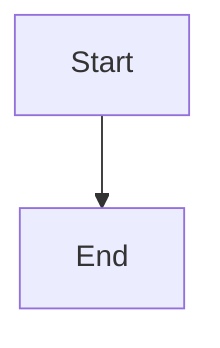

# Architecture Diagrams Index

This directory contains Mermaid-based architecture diagrams for the KD-GAT project.

---

## Available Diagrams

### [Parameter Flow](parameter_flow.md)
**Purpose**: Shows how configuration parameters flow from CLI → SLURM → Training

**Key Topics**:
- Frozen Config Pattern
- Config validation layers
- SLURM job submission flow
- Model args mapping

**When to use**: Understanding how CLI arguments become training configs

---

### [Directory Structure](directory_structure.md)
**Purpose**: Visualizes the canonical experiment directory hierarchy

**Key Topics**:
- Canonical path format: `{modality}/{dataset}/{learning_type}/...`
- Artifact locations (models, checkpoints, configs, logs)
- Knowledge distillation structure
- Path resolution

**When to use**: Understanding where experiments and artifacts are saved

---

## Future Diagrams

These diagrams are planned but not yet implemented:

### Knowledge Distillation Architecture
**Purpose**: Teacher-student relationship and loss computation

**Status**: Partial coverage in [ARCHITECTURE.md](../ARCHITECTURE.md)

---

### Model Architectures (VGAE, GAT, DQN)
**Purpose**: Detailed layer-by-layer model architectures

**Status**: Planned (low priority)

**Location**: `models/` subdirectory

---

## Main Entry Point

For a comprehensive architecture overview, start here:
- **[docs/ARCHITECTURE.md](../ARCHITECTURE.md)** - Main architecture documentation with embedded diagrams

---

## Viewing Diagrams

### In GitHub
Mermaid diagrams render natively in GitHub's markdown viewer. Just open any `.md` file in this directory.

### In VS Code
Install the **Mermaid Preview** extension:
```bash
code --install-extension bierner.markdown-mermaid
```

Then open any `.md` file and use `Ctrl+Shift+V` (or `Cmd+Shift+V` on Mac) for preview.

### In CLI
Use [mermaid-cli](https://github.com/mermaid-js/mermaid-cli):
```bash
npm install -g @mermaid-js/mermaid-cli
mmdc -i parameter_flow.md -o parameter_flow.png
```

---

## Maintenance Guidelines

1. **Update diagrams when architecture changes** - treat them like code
2. **Keep diagrams simple** - one concept per diagram
3. **Use consistent colors**:
   - Blue (#bbdefb) for unsupervised/VGAE
   - Green (#c8e6c9) for supervised/GAT
   - Orange (#ffe0b2) for RL/DQN
   - Yellow (#fff9c4) for configs/artifacts
   - Red (#ffcdd2) for errors/failures
4. **Test locally before committing** - use VS Code Mermaid preview
5. **Include notes explaining non-obvious flows**

---

## Contributing New Diagrams

When adding a new diagram:

1. Create a new `.md` file in this directory
2. Use Mermaid syntax (flowchart, sequence, or class diagram)
3. Add a link to this README
4. Reference from [ARCHITECTURE.md](../ARCHITECTURE.md) if relevant
5. Test rendering in GitHub/VS Code

**Template**:
```markdown
# Diagram Title

Brief description of what this diagram shows.

---

## Diagram



---

## Explanation

Detailed explanation of the diagram components.

---

## References

- Related file: [src/example.py](../../src/example.py)
```
