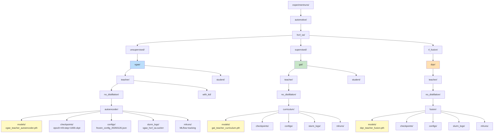

# Experiment Directory Structure

This document explains the canonical hierarchical directory structure used for organizing experiments in KD-GAT.

---

## Canonical Path Format

All experiments follow this structure:

```
experimentruns/{modality}/{dataset}/{learning_type}/{model}/{model_size}/{distillation}/{mode}/
```

### Path Components

| Component | Values | Example |
|-----------|--------|---------|
| `modality` | automotive, industrial, robotics | `automotive` |
| `dataset` | hcrl_sa, hcrl_ch, set_01, set_02, ... | `hcrl_sa` |
| `learning_type` | unsupervised, supervised, rl_fusion | `supervised` |
| `model` | vgae, gat, dqn | `gat` |
| `model_size` | teacher, student | `teacher` |
| `distillation` | no_distillation, with_kd | `no_distillation` |
| `mode` | autoencoder, curriculum, fusion, normal | `curriculum` |

---

## Full Directory Tree



---

## Example: Full Pipeline Structure

After running a complete 3-stage pipeline:

```bash
./can-train pipeline \
  --modality automotive \
  --model vgae,gat,dqn \
  --learning-type unsupervised,supervised,rl_fusion \
  --training-strategy autoencoder,curriculum,fusion \
  --dataset hcrl_sa \
  --model-size teacher \
  --distillation no-kd \
  --submit
```

**Resulting structure**:

```
experimentruns/
└── automotive/
    └── hcrl_sa/
        ├── unsupervised/
        │   └── vgae/
        │       └── teacher/
        │           └── no_distillation/
        │               └── autoencoder/
        │                   ├── models/
        │                   │   └── vgae_teacher_autoencoder.pth
        │                   ├── checkpoints/
        │                   │   └── epoch=49-step=1000.ckpt
        │                   ├── configs/
        │                   │   └── frozen_config_20260126_215548.json
        │                   ├── slurm_logs/
        │                   │   ├── vgae_hcrl_sa_autoencode_20260126_215548.out
        │                   │   ├── vgae_hcrl_sa_autoencode_20260126_215548.err
        │                   │   └── vgae_hcrl_sa_autoencode.sh
        │                   └── mlruns/
        │                       └── 0/
        │
        ├── supervised/
        │   └── gat/
        │       └── teacher/
        │           └── no_distillation/
        │               └── curriculum/
        │                   ├── models/
        │                   │   └── gat_teacher_curriculum.pth
        │                   ├── checkpoints/
        │                   ├── configs/
        │                   │   └── frozen_config_20260126_220001.json
        │                   ├── slurm_logs/
        │                   │   ├── gat_hcrl_sa_curriculum_20260126_220001.out
        │                   │   ├── gat_hcrl_sa_curriculum_20260126_220001.err
        │                   │   └── gat_hcrl_sa_curriculum.sh
        │                   └── mlruns/
        │
        └── rl_fusion/
            └── dqn/
                └── teacher/
                    └── no_distillation/
                        └── fusion/
                            ├── models/
                            │   └── dqn_teacher_fusion.pth
                            ├── checkpoints/
                            ├── configs/
                            │   └── frozen_config_20260126_220158.json
                            ├── slurm_logs/
                            │   ├── dqn_hcrl_sa_fusion_20260126_220158.out
                            │   ├── dqn_hcrl_sa_fusion_20260126_220158.err
                            │   └── dqn_hcrl_sa_fusion.sh
                            └── mlruns/
```

---

## Artifact Locations

Each experiment directory contains:

### 1. `models/` - Final Trained Models

**Purpose**: Store best model weights after training completes

**Files**:
- `{model}_{model_size}_{mode}.pth` - PyTorch state dict
- Example: `vgae_teacher_autoencoder.pth`, `gat_student_curriculum.pth`

**Usage**:
```python
from pathlib import Path
model_path = Path("experimentruns/.../models/vgae_teacher_autoencoder.pth")
model.load_state_dict(torch.load(model_path))
```

---

### 2. `checkpoints/` - Training Checkpoints

**Purpose**: Periodic snapshots during training (for resuming)

**Files**:
- `epoch={epoch}-step={step}.ckpt` - Lightning checkpoint format
- `last.ckpt` - Most recent checkpoint
- Example: `epoch=49-step=1000.ckpt`

**Usage**: Automatic via Lightning's `ModelCheckpoint` callback

---

### 3. `configs/` - Frozen Configurations

**Purpose**: Store exact configuration used for this run

**Files**:
- `frozen_config_{timestamp}.json` - Serialized CANGraphConfig
- Example: `frozen_config_20260126_220158.json`

**Usage**:
```python
from src.config.frozen_config import load_frozen_config
config = load_frozen_config("experimentruns/.../configs/frozen_config_20260126_220158.json")
```

**Benefits**:
- ✅ Reproducible: Exact params saved per run
- ✅ Auditable: Know what config produced which results
- ✅ Self-contained: No dependency on CLI flags or code state

---

### 4. `slurm_logs/` - Job Logs and Scripts

**Purpose**: SLURM job outputs and scripts

**Files**:
- `{job_name}_{timestamp}.out` - Standard output
- `{job_name}_{timestamp}.err` - Standard error
- `{job_name}.sh` - SLURM batch script

**Location Change** (2026-01-26):
- **Old**: Centralized in `experimentruns/slurm_runs/`
- **New**: Inside experiment directory at `slurm_logs/`

**Benefits**:
- ✅ All artifacts in one place
- ✅ Easy to correlate logs with specific runs
- ✅ Cleaner organization

---

### 5. `mlruns/` - MLflow Tracking

**Purpose**: Training metrics, hyperparameters, artifacts

**Structure**:
```
mlruns/
└── 0/                          # Experiment ID
    └── {run_id}/               # Run UUID
        ├── meta.yaml           # Run metadata
        ├── metrics/            # Training metrics
        │   ├── train_loss
        │   ├── val_loss
        │   └── val_accuracy
        ├── params/             # Hyperparameters
        └── artifacts/          # Model artifacts
```

**Usage**:
```bash
# View MLflow UI
mlflow ui --backend-store-uri experimentruns/.../mlruns
```

---

## Cache Directory

Processed graphs are cached globally:

```
experimentruns/
└── automotive/
    └── hcrl_sa/
        └── cache/
            └── processed_graphs.pt    # PyTorch tensors
```

**Purpose**: Avoid re-processing graphs for every experiment on same dataset

**Regeneration**: Automatically regenerates if:
- Dataset files change
- Cache format is invalid
- Cache doesn't exist

---

## Knowledge Distillation Structure

When using `--distillation with-kd`, the structure includes both teacher and student:

```
experimentruns/automotive/hcrl_sa/
├── supervised/gat/
│   ├── teacher/no_distillation/curriculum/
│   │   └── models/gat_teacher_curriculum.pth    ← Teacher model
│   │
│   └── student/with_kd/curriculum/
│       ├── configs/
│       │   └── frozen_config_20260126.json
│       │       # Contains: teacher_model_path pointing to teacher
│       └── models/gat_student_curriculum.pth    ← Distilled student
```

**Student config references teacher**:
```json
{
  "training": {
    "mode": "curriculum",
    "use_knowledge_distillation": true,
    "teacher_model_path": "experimentruns/.../teacher/.../gat_teacher_curriculum.pth"
  }
}
```

---

## Benefits of Canonical Structure

### 1. **Predictable Paths**
No guessing where artifacts are - canonical structure is deterministic

### 2. **Easy Model Discovery**
```python
from src.paths import find_model
vgae_path = find_model(
    model_type='vgae',
    dataset='hcrl_sa',
    mode='autoencoder',
    model_size='teacher'
)
# Returns: experimentruns/.../models/vgae_teacher_autoencoder.pth
```

### 3. **Natural Organization**
Related experiments naturally grouped:
- All VGAE experiments under `unsupervised/vgae/`
- All GAT experiments under `supervised/gat/`
- Teacher vs student clearly separated

### 4. **Version Control Friendly**
```bash
# Ignore all experiment artifacts but keep structure
# .gitignore:
experimentruns/*/
!experimentruns/.gitkeep
```

### 5. **SLURM Job Naming**
Job names match directory structure:
```
vgae_hcrl_sa_autoencoder       # unsupervised/vgae/.../autoencoder
gat_hcrl_sa_curriculum          # supervised/gat/.../curriculum
dqn_hcrl_sa_fusion              # rl_fusion/dqn/.../fusion
```

---

## Path Resolution

**Implementation**: [src/paths.py](../../src/paths.py)

```python
def get_experiment_directory(config: CANGraphConfig) -> Path:
    """
    Build canonical experiment path from config.

    Format: {modality}/{dataset}/{learning_type}/{model}/{model_size}/{distillation}/{mode}/
    """
    parts = [
        config.experiment_root,  # experimentruns
        config.modality,         # automotive
        config.dataset.name,     # hcrl_sa
        learning_type,           # supervised
        model_name,              # gat
        config.model_size,       # teacher
        distillation_str,        # no_distillation
        config.training.mode,    # curriculum
    ]
    return Path("/".join(parts))
```

**Auto-discovery**: Models can be found using patterns:
```python
# Find most recent VGAE model
vgae_models = glob(f"{experiment_dir}/models/vgae_teacher_*.pth")
latest_vgae = max(vgae_models, key=os.path.getmtime)  # Most recent
```

---

## References

- **Path Resolution**: [src/paths.py](../../src/paths.py)
- **Model Auto-Discovery**: [src/paths.py:find_model()](../../src/paths.py)
- **SLURM Logs**: [src/cli/job_manager.py](../../src/cli/job_manager.py)
- **MLflow Integration**: [src/training/trainer.py](../../src/training/trainer.py)
