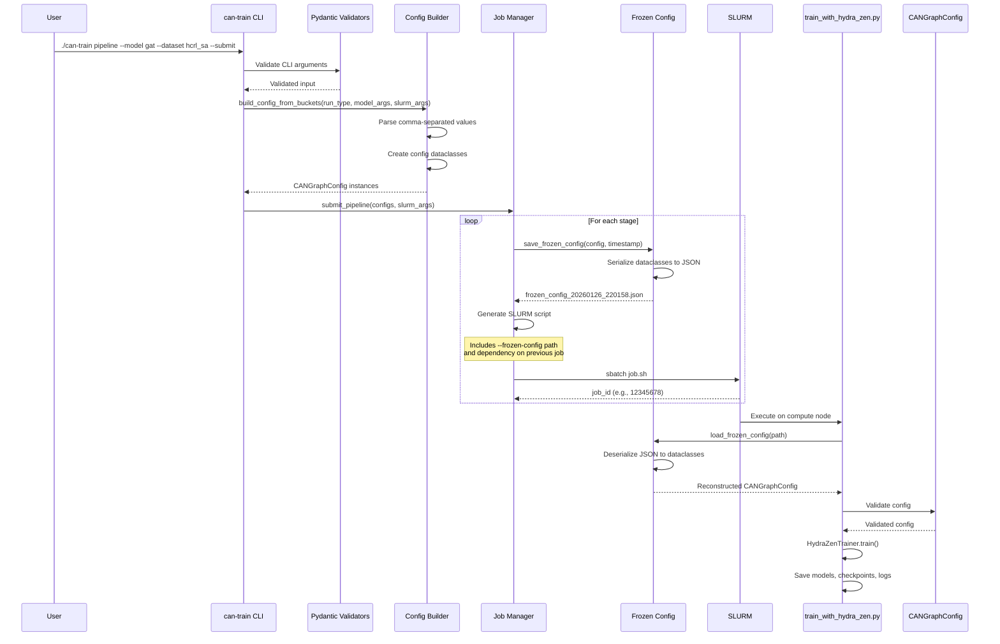
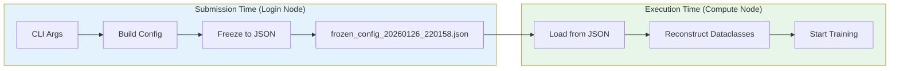
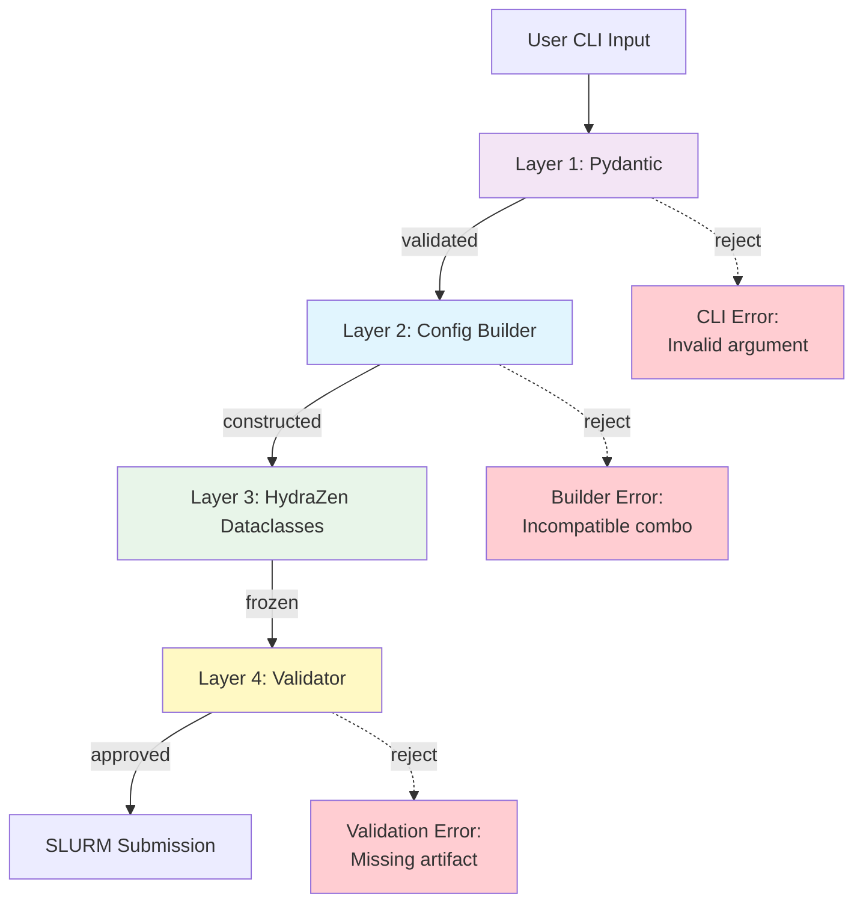
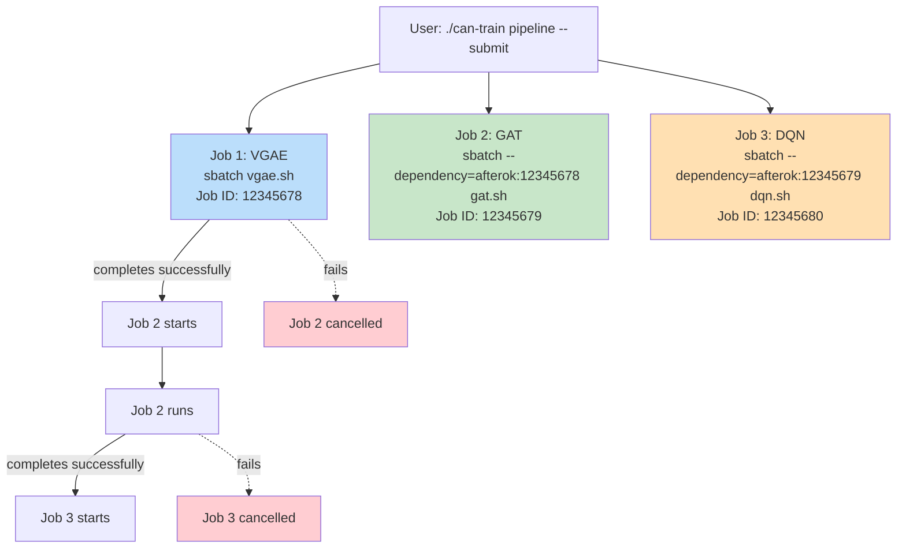
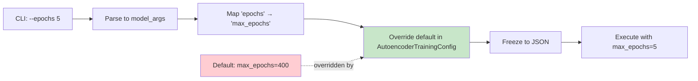

# Parameter Flow: CLI → SLURM → Training

This diagram shows how configuration parameters flow through the KD-GAT system from CLI submission to training execution.

---

## Complete Flow



---

## Frozen Config Pattern

### Why Frozen Configs?

**Problem**: Traditional config systems are fragile:
- CLI flags can change between submission and execution
- Hydra configs require exact Python environment
- Hard to reproduce old runs after code changes

**Solution**: Freeze entire config to JSON at submission time:



**Benefits**:
- ✅ Reproducible: Config is self-contained
- ✅ Auditable: Exact params saved per run
- ✅ Robust: Works even if CLI changes

---

## Config Validation Layers



**Layer 1: Pydantic** ([pydantic_validators.py](../../src/cli/pydantic_validators.py))
- Validates CLI input types
- Enforces P→Q rules (e.g., model size must match distillation)
- User-facing error messages

**Layer 2: Config Builder** ([config_builder.py](../../src/cli/config_builder.py))
- Parses comma-separated buckets
- Maps CLI params → config fields
- Creates HydraZen dataclass instances

**Layer 3: HydraZen** ([hydra_zen_configs.py](../../src/config/hydra_zen_configs.py))
- Dataclass schema definitions
- Default values
- Type hints

**Layer 4: Validator** ([validator.py](../../src/cli/validator.py))
- Pre-flight checks (dataset exists, teacher model found, etc.)
- SLURM resource validation
- Mode-specific checks (KD requirements, fusion artifacts)

---

## Example: Pipeline Submission

### User Command
```bash
./can-train pipeline \
  --modality automotive \
  --model vgae,gat,dqn \
  --learning-type unsupervised,supervised,rl_fusion \
  --training-strategy autoencoder,curriculum,fusion \
  --dataset hcrl_sa \
  --model-size teacher \
  --distillation no-kd \
  --epochs 5 \
  --submit
```

### Step 1: CLI Parsing
```python
args.modality = 'automotive'
args.model = 'vgae,gat,dqn'
args.learning_type = 'unsupervised,supervised,rl_fusion'
args.training_strategy = 'autoencoder,curriculum,fusion'
args.dataset = 'hcrl_sa'
args.model_size = 'teacher'
args.distillation = 'no-kd'
args.epochs = 5
args.submit = True
```

### Step 2: Build Configs (3 stages)
```python
# Job 1: VGAE Autoencoder
run_type = {
    'model': 'vgae',
    'dataset': 'hcrl_sa',
    'mode': 'autoencoder',
    'modality': 'automotive',
    'model_size': 'teacher',
    'distillation': 'no-kd',
    'learning_type': 'unsupervised'
}
model_args = {'epochs': 5}
slurm_args = {'gpus': 1, 'walltime': '06:00:00', ...}

# Job 2: GAT Curriculum (similar structure)
# Job 3: DQN Fusion (similar structure)
```

### Step 3: Freeze Configs
```json
// experimentruns/automotive/hcrl_sa/unsupervised/vgae/teacher/no_distillation/autoencoder/configs/frozen_config_20260126_220158.json
{
  "_type": "CANGraphConfig",
  "_frozen_at": "2026-01-26T22:01:58.375388",
  "_version": "1.0.0",
  "modality": "automotive",
  "model_size": "teacher",
  "distillation": "no_distillation",
  "experiment_root": "experimentruns",
  "model": {
    "_type": "VGAEConfig",
    "num_ids": 2049,
    "embedding_dim": 64,
    "hidden_dims": [1024, 512],
    "latent_dim": 96,
    ...
  },
  "training": {
    "_type": "AutoencoderTrainingConfig",
    "mode": "autoencoder",
    "max_epochs": 5,
    ...
  },
  ...
}
```

### Step 4: Generate SLURM Script
```bash
#!/bin/bash
#SBATCH --job-name=vgae_hcrl_sa_autoencoder
#SBATCH --account=PAS2022
#SBATCH --time=06:00:00
#SBATCH --gpus-per-node=1
#SBATCH --mem=64G

echo "Job ID: $SLURM_JOB_ID"
echo "Node: $SLURM_NODELIST"
echo "Start: $(date)"

python train_with_hydra_zen.py \
  --frozen-config experimentruns/.../frozen_config_20260126_220158.json

echo "Exit code: $?"
echo "End: $(date)"
```

### Step 5: Submit to SLURM
```bash
$ sbatch experimentruns/.../slurm_logs/vgae_hcrl_sa_autoencoder.sh
Submitted batch job 12345678
```

### Step 6: Execution on Compute Node
```python
# train_with_hydra_zen.py
config = load_frozen_config(args.frozen_config)  # Deserialize JSON → dataclasses
trainer = HydraZenTrainer(config)
model, lightning_trainer = trainer.train()
```

---

## SLURM Job Dependencies

When pipeline stages depend on each other, SLURM ensures sequential execution:



**Key Point**: If any job fails, downstream jobs are automatically cancelled by SLURM.

---

## Model Args Flow

Model args override default config values:



**Mapping** ([config_builder.py:393](../../src/cli/config_builder.py#L393)):
```python
arg_mapping = {
    'epochs': 'max_epochs',
    'learning_rate': 'learning_rate',
    'batch_size': 'batch_size',
    ...
}
```

---

## References

- **Frozen Config Implementation**: [src/config/frozen_config.py](../../src/config/frozen_config.py)
- **CLI Entry Point**: [src/cli/main.py](../../src/cli/main.py)
- **Job Manager**: [src/cli/job_manager.py](../../src/cli/job_manager.py)
- **Config Builder**: [src/cli/config_builder.py](../../src/cli/config_builder.py)
- **Training Script**: [train_with_hydra_zen.py](../../train_with_hydra_zen.py)
